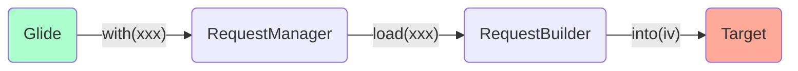
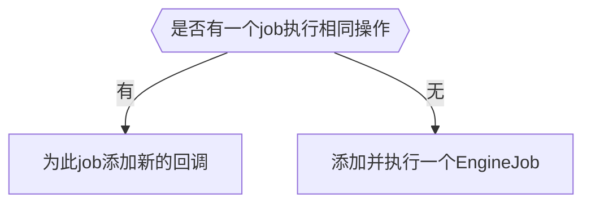
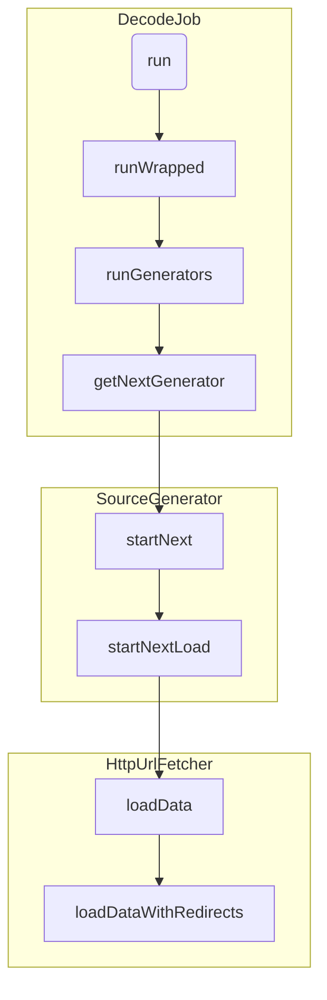
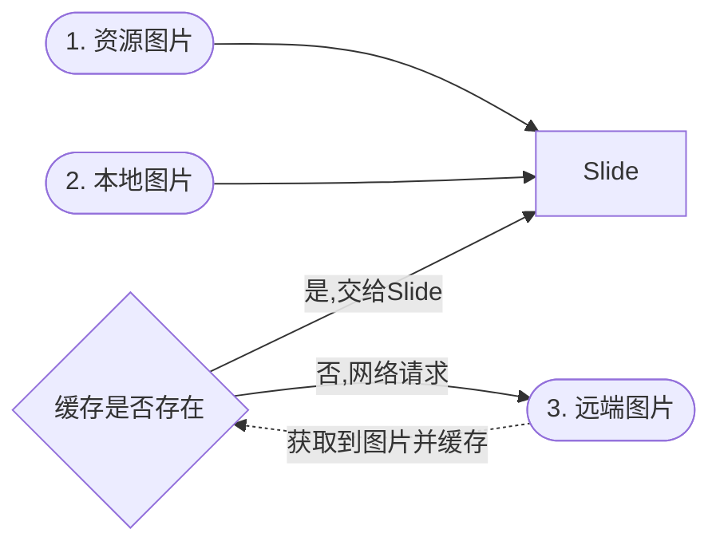

> 本文基于Glide 4.11.0

阅读前请参考[Glide 源码分析解读-基于最新版Glide 4.9.0](https://zhuanlan.zhihu.com/p/60425157)一文，该文章中，将Glide中各个部分的作用分析的非常好了。

Glide几乎是现在做Android图片加载的最佳选择了。如此优秀的一个框架是如何实现的呢？如果让我们自己来实现该怎么做呢？我们就通过自己实现一个低配版Glide的方式，来探究Glide中是如何实现的。

我们就称我们自己低配版Glide为**Slide**。那么Slide要实现哪些功能呢？简单来说，就是**获取图片**+**界面显示**。我们通过先构架大体框架，再分步丰富其中细节的方式，来构建Slide的整体结构。


```java
Glide.with(xxx).load(url).into(iv);
```

这是Glide一个典型的最为简单的调用过程。那么在这个过程中发生了哪些事情呢？

我们可以通过这个链式调用的返回值发现，有如下过程：



## Glide.with(xxx)发生了什么事？

阅读源码发现，`Glide.with(xxx)`的最终实现类是*RequestManagerRetriever.java*类。继续跟踪，我们在这个类中，看到这样一个方法。

```java
@NonNull
private RequestManager supportFragmentGet(
  @NonNull Context context,
  @NonNull FragmentManager fm,
  @Nullable Fragment parentHint,
  boolean isParentVisible) {
  SupportRequestManagerFragment current = getSupportRequestManagerFragment(fm, parentHint);
  RequestManager requestManager = current.getRequestManager();

  .....

    return requestManager;
}
```

重点关注这个getSupportRequestManagerFragment方法。

```java
//getSupportRequestManagerFragment
@NonNull
private SupportRequestManagerFragment getSupportRequestManagerFragment(
  @NonNull final FragmentManager fm, @Nullable Fragment parentHint) {
  SupportRequestManagerFragment current =
    (SupportRequestManagerFragment) fm.findFragmentByTag(FRAGMENT_TAG);
  if (current == null) {
    current = pendingSupportRequestManagerFragments.get(fm);
    if (current == null) {
      current = new SupportRequestManagerFragment();
      current.setParentFragmentHint(parentHint);
      pendingSupportRequestManagerFragments.put(fm, current);
      fm.beginTransaction().add(current, FRAGMENT_TAG).commitAllowingStateLoss();
      handler.obtainMessage(ID_REMOVE_SUPPORT_FRAGMENT_MANAGER, fm).sendToTarget();
    }
  }
  return current;
}
```

其实，这里是一个Glide检测到界面生命周期的关键了。**Glide就是通过像当前Activity添加一个一个无UI的Fragment来探测生命周期的**。

> **注意：**在执行了添加fragment的语句`fm.beginTransaction().add(current, FRAGMENT_TAG).commitAllowingStateLoss()`后，又马上通过handler发送了一个一个message，这里需要熟悉Handler机制才能理解，简单来说，就是添加fragment操作，实际上也是通过handler执行的，这是一个异步的过程，如何检测到fragment已经添加完成了呢？就是在`commitAllowingStateLoss`后，马上去发送一条指定的消息，利用handler处理message的顺序性，来获知fragment已经添加完成。

经过添加*SupportRequestManagerFragment*后，我们获得了探测当前界面生命周期的能力。

继续阅读`supportFragmentGet`方法代码，**RequestManager**是从**SupportRequestManagerFragment**拿到的，如果拿到的是空，则创建一个，设置到该fragment当中去。


## RequestManager.load(xxx)发生了什么？

我们以`load(url)`为例，来探究这部分代码。

这个方法，返回的是*RequestBuilder*这个类，看名字就知道，这是一个构建者模式中的Builder类，主要是在添加各种配置项，比如RequestOptions、RequestListener等。


## RequestBuilder.into(iv)发生了什么？

其实，这里才是真正开始触发发起请求的地方。

### RequestBuilder

我们把`into(ImageView)`方法作为入口，一路跟踪，可以发现最终的实现是如下方法。

```java
private <Y extends Target<TranscodeType>> Y into(
  @NonNull Y target,
  @Nullable RequestListener<TranscodeType> targetListener,
  BaseRequestOptions<?> options,
  Executor callbackExecutor) {
  Preconditions.checkNotNull(target);
  if (!isModelSet) {
    throw new IllegalArgumentException("You must call #load() before calling #into()");
  }

  Request request = buildRequest(target, targetListener, options, callbackExecutor);

  Request previous = target.getRequest();
  if (request.isEquivalentTo(previous)
      && !isSkipMemoryCacheWithCompletePreviousRequest(options, previous)) {
    // If the request is completed, beginning again will ensure the result is re-delivered,
    // triggering RequestListeners and Targets. If the request is failed, beginning again will
    // restart the request, giving it another chance to complete. If the request is already
    // running, we can let it continue running without interruption.
    if (!Preconditions.checkNotNull(previous).isRunning()) {
      // Use the previous request rather than the new one to allow for optimizations like skipping
      // setting placeholders, tracking and un-tracking Targets, and obtaining View dimensions
      // that are done in the individual Request.
      previous.begin();
    }
    return target;
  }

  requestManager.clear(target);
  target.setRequest(request);
  requestManager.track(target, request);

  return target;
}
```

这个方法主要是做了以下事情：

1. 是否已经有一个request在处理相同的请求，如果有，则判断是否正在运行，没有正在运行则开始运行；
2. 如果没有一个request在处理此请求，则对target做一些清理操作，与之前的请求解绑，为当前target设置新的请求，然后requestManager开始追踪这个请求。

接下来我们就按照`requestManager.track(target, request)`这段代码继续追踪。来到RequestManager的track方法。

### RequestManager

```java
synchronized void track(@NonNull Target<?> target, @NonNull Request request) {
  targetTracker.track(target);
  requestTracker.runRequest(request);
}
```

这个方法很简单，只有两个方法。

#### TargetTracker

```java
private final Set<Target<?>> targets =
      Collections.newSetFromMap(new WeakHashMap<Target<?>, Boolean>());

public void track(@NonNull Target<?> target) {
  targets.add(target);
}
```

这里把一个target存放在WeakHashMap中，因为target是与生命周期有关的东西，比如ImageView对应的**ImageViewTarget**，所以这么做是为了防止内存泄漏。

#### RequestTracker

```java
/** Starts tracking the given request. */
public void runRequest(@NonNull Request request) {
  requests.add(request);
  if (!isPaused) {
    request.begin();
  } else {
    request.clear();
    if (Log.isLoggable(TAG, Log.VERBOSE)) {
      Log.v(TAG, "Paused, delaying request");
    }
    pendingRequests.add(request);
  }
}
```

这里是将暂停的request加入到pendingRequests中去，如果不是暂停的request，则调用其begin方法。

我们查看*Request*类的子类，可以看到下图。


可以看到一共有4个类实现了*Request*类，其中*FakeRequest*类是用于测试的，不去考虑。其他三个类的作用如下：

1. **ThumbnailRequestCoordinator:** 用来加载thumbnail；
2. **ErrorRequestCoordinator:** 用来加载错误时候，展示错误状态； 
3. **SingleRequest:** 这才是用来加载目标图片的request。

我们重点去看SingleRequest的begin方法。

### SingleRequest

```java
public void begin() {
  synchronized (requestLock) {
    assertNotCallingCallbacks();
    stateVerifier.throwIfRecycled();
    startTime = LogTime.getLogTime();
    if (model == null) {
      if (Util.isValidDimensions(overrideWidth, overrideHeight)) {
        width = overrideWidth;
        height = overrideHeight;
      }
      // Only log at more verbose log levels if the user has set a fallback drawable, because
      // fallback Drawables indicate the user expects null models occasionally.
      int logLevel = getFallbackDrawable() == null ? Log.WARN : Log.DEBUG;
      onLoadFailed(new GlideException("Received null model"), logLevel);
      return;
    }

    if (status == Status.RUNNING) {
      throw new IllegalArgumentException("Cannot restart a running request");
    }

    // If we're restarted after we're complete (usually via something like a notifyDataSetChanged
    // that starts an identical request into the same Target or View), we can simply use the
    // resource and size we retrieved the last time around and skip obtaining a new size, starting
    // a new load etc. This does mean that users who want to restart a load because they expect
    // that the view size has changed will need to explicitly clear the View or Target before
    // starting the new load.
    if (status == Status.COMPLETE) {
      onResourceReady(
        resource, DataSource.MEMORY_CACHE, /* isLoadedFromAlternateCacheKey= */ false);
      return;
    }

    // Restarts for requests that are neither complete nor running can be treated as new requests
    // and can run again from the beginning.

    status = Status.WAITING_FOR_SIZE;
    if (Util.isValidDimensions(overrideWidth, overrideHeight)) {
      onSizeReady(overrideWidth, overrideHeight);
    } else {
      target.getSize(this);
    }

    if ((status == Status.RUNNING || status == Status.WAITING_FOR_SIZE)
        && canNotifyStatusChanged()) {
      target.onLoadStarted(getPlaceholderDrawable());
    }
    if (IS_VERBOSE_LOGGABLE) {
      logV("finished run method in " + LogTime.getElapsedMillis(startTime));
    }
  }
}
```

代码虽长，但是结构简单。主要做了以下事情：

1. 检查model是否是空，model就是要加载的数据来源，比如url、resourceId、File等；
2. 判断request状态，不能重新开始一个正在运行的请求；
3. 判断request状态，如果是已经完成的请求，则说明资源已经存在，直接调用`onResourceReady`方法并返回；
4. 接下来就来到判断target尺寸的过程了，如果target尺寸已经确定，比如view尺寸measure结束后，则调用`onSizeReady`方法，**注意：实际的网络请求就在这个onSizeReady方法中，因为只有target的尺寸确定了，才能进行请求并处理图片；**
5. 如果尺寸未确定，则调用`target.getSize`方法去监听尺寸事件，具体可以参考`ViewTarget#getSize`方法，这是一个通过onPreDrawListener来监听尺寸的；
6. 接下来回调`onLoadStarted`方法，并且显示加载过程状态。

我们着重看网络请求那个分支，也就是`onSizeReady`方法。

```java
@Override
public void onSizeReady(int width, int height) {
  ......
	loadStatus = engine.load(
    glideContext,
    model,
    requestOptions.getSignature(),
    this.width,
    this.height,
    requestOptions.getResourceClass(),
    transcodeClass,
    priority,
    requestOptions.getDiskCacheStrategy(),
    requestOptions.getTransformations(),
    requestOptions.isTransformationRequired(),
    requestOptions.isScaleOnlyOrNoTransform(),
    requestOptions.getOptions(),
    requestOptions.isMemoryCacheable(),
    requestOptions.getUseUnlimitedSourceGeneratorsPool(),
    requestOptions.getUseAnimationPool(),
    requestOptions.getOnlyRetrieveFromCache(),
    this,
    callbackExecutor
  );
  ...
}
```

关键代码来了！这个`engine`就是Glide的核心。这个engine是在Glide初始化时候生成的一个实例。

### Engine

Engine不只是用于加载图片，而是一个任务执行核心引擎，它要执行的不只是请求远程图片的任务，包括解码任务等，它执行的实际上是一个个的job。

跟踪上一阶段中的`engine.load`方法，来到是这个方法的关键部分——调用`waitForExistingOrStartNewJob`。

在这个方法中，主要做了以下事情：



#### EngineJob.start(decodeJob)

```java
public synchronized void start(DecodeJob<R> decodeJob) {
  this.decodeJob = decodeJob;
  GlideExecutor executor =
    decodeJob.willDecodeFromCache() ? diskCacheExecutor : getActiveSourceExecutor();
  executor.execute(decodeJob);
}
```

这里执行的是decodeJob。

> 这里需要着重关注一点，就是`executor.execute(decodeJob)`的时候，就已经通过*GlideExecutor*的sourceExecutor.Builder创建了一个**ThreadPoolExecutor**，也就是在这里实现线程池异步执行任务。**ThreadPoolExecutor**并不是Glide提供的实现，而是在java.util.concurrent包下。

#### DecodeJob

DecodeJob是一个*Runnable*类，所以，我们查看其run方法。

接下来的调用路径参考下图。



经过这么长的调用链，我们终于来到了网络请求的部分，我们可以看到Glide原生使用的*HttpURLConnection*进行网络请求的。**获取到InputStream后，在SourceGenerator中的cacheData方法进行缓存处理。**

#### 获取到数据后的处理

通过`DataFetcherGenerator.FetcherReadyCallback`可以探知到数据获取成功或者失败，如果获取成功，则在`DecodeJob#onDataFetcherReady`中处理。关键代码如下：

```java
public void onDataFetcherReady(
      Key sourceKey, Object data, DataFetcher<?> fetcher, DataSource dataSource, Key attemptedKey) {
  .....
  if (Thread.currentThread() != currentThread) {
    runReason = RunReason.DECODE_DATA;
    callback.reschedule(this);
  } else {
    .....
  }
}
```

更改任务状态，重新执行此任务，则重新执行到`getNextGenerator`方法，此时则会返回**DataCacheGenerator**来处理从Disk缓存加载的任务。

## 获取图片

首先，图片来源有哪些？

1. 资源图片：drawable, assets, raw, mipmap这些程序中自带的图片；
2. 本地图片：本地存储设备上的图片；
3. 远端图片：我们服务器或者来自第三方服务器的图片，通过URL来获取。这就需要**异步网络请求**，请求结束以后，要**缓存**图片，避免重复请求远端图片，造成时间、网络的浪费。




那么接下来，要丰富的细节，就来到了**网络请求**和**缓存**了。


### 网络请求


### 缓存

