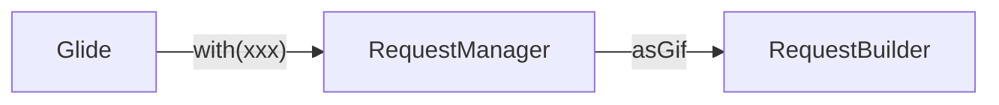
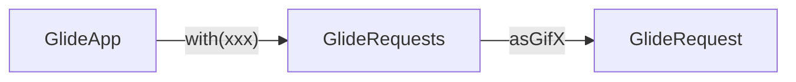

项目Demo地址：[GifHelper](https://github.com/boybeak/GifHelper)

**什么是APT？**

**APT**是**Annotation Processing Tool**的简称，即**编译时注解处理器**。它是一个javac的工具，在编译时，通过注解，按照规则自动生成相关代码的工具。

**APT与Glide什么关系？**

我们通常通过在build.gradle加入这样一段代码来引入Glide库。

```groovy
repositories {
  google()
  jcenter()
}

dependencies {
  implementation 'com.github.bumptech.glide:glide:4.11.0'
  annotationProcessor 'com.github.bumptech.glide:compiler:4.11.0'
}
```

这里有一个`annotationProcessor`，这就是对Glide提供的APT进行引用。我们查看Glide的源码结构，可以看到一个名为*annotation*的文件夹，这里就是与APT有关的部分。


接下来我们先通过GIF优化，看一看Glide的APT能实现的神奇效果，在这之后，再来分析Glide是如何通过APT实现的。

> **注意：**如果使用kotlin需要先加入`apply plugin: 'kotlin-kapt'`插件，并且将`annotationProcessor`改成`kapt`。

## GIF优化

**为什么要优化GIF？**

有人可能会有疑问，Glide相比其他图片加载框架的优势之一，就是支持GIF，为什么还要做优化呢？

先看两个截图来对比优化前后的CPU和内存使用情况。


我们可以看出，优化后，CPU和内存状况都好了很多，那么我们是怎么做的呢？这就需要用到谷歌官方的两个库——[giflib](https://android.googlesource.com/platform/external/giflib/+/refs/heads/master)和[FrameSequence](https://android.googlesource.com/platform/frameworks/ex/+/refs/heads/master/framesequence/)，这两个库需要我们自己编译成.so文件，具体可以参考示例项目[GifHelper](https://github.com/boybeak/GifHelper)。

我们查看GifHolder中的代码。

```kotlin
class GifHolder(v: View) : AbsHolder<GifItem>(v) {
	...
  private val gifIV = view<ImageView>(R.id.gifIV)
  override fun onBind(item: GifItem, position: Int, absAdapter: AnyAdapter) {
    if (item.useGifX) {
      // 优化后的加载方式
    	GlideApp.with(itemView).asGifX().load(item.source()).into(gifIV)
    } else {
      // 优化前的加载方式
      Glide.with(itemView).asGif().load(item.source()).into(gifIV)
    }
    ....
  }
}
```

我们可以看到，加载后有这样一条语句：`GlideApp.with(itemView).asGifX().load(item.source()).into(gifIV)`，也许你会懵逼，哪里有GlideApp？哪里有asGifX()方法？我引入Glide后怎么没有看到这两个东西？这就涉及到了APT的内容了。想要看Glide官方文档的可以看[这里](http://bumptech.github.io/glide/doc/configuration.html#glidemodule)。

一切的起因，要从**@GlideModule**这个注解说起，我们打开demo中的MyAppGlideModule类，可以看到这个类有一个@GlideModule注解。

```kotlin
@GlideModule
class MyAppGlideModule : AppGlideModule() {
  override fun registerComponents(context: Context, glide: Glide, registry: Registry) {
    super.registerComponents(context, glide, registry)
    registry.append(Registry.BUCKET_GIF, InputStream::class.java,
                    FrameSequenceDrawable::class.java, GifDecoder(glide.bitmapPool))
  }
}
```

我们再点开这个注解的源码，如下：

```java
@Target(ElementType.TYPE)
@Retention(RetentionPolicy.CLASS)
public @interface GlideModule {
  /**
   * Returns the name of the class that will be used as a replacement for {@code
   * com.bumptech.glide.Glide} in Applications that depend on Glide's generated code.
   */
  String glideName() default "GlideApp";
}
```

我们现在看到“GlideApp”了，是glideName这个注解属性的默认值。我们来逐条分析一下这个注解类的相关信息：

- `@Target(ElementType.TYPE)`：指明这个注解的作用对象——只对类生效；
- `@Retention(RetentionPolicy.CLASS)`：指明了这个注解的作用阶段——编译时记录在class文件中；
- `public @interface GlideModule`：这是一个注解接口，接口名**GlideModule**；
- `String glideName() default "GlideApp"`：这个注解接口需要一个名为*glideName*的属性，属性默认值为“GlideApp”。

>RetentionPolicy：
>
>- **SOURCE**：这样的注解会被编译器擦除，只在编码阶段生效，目的是为了提示开发者，比如**@IntDef**、**@StringDef**、**@Visibility**、**@NonNull**；
>- **CLASS**：记录在class文件中，编译时对编译器可见，运行时对VM不可见，这是RetentionPolicy的默认值，比如**@NotNull**;
>- **RUNTIME**：记录在class文件中，在运行时需要反射获取其属性值，比如**@Column**。

就是这个**@GlideModule**属性，为我们生成了GlideApp类，这其中的生成过程，我们稍后再说，先把Gif优化的流程说完。

添加**@GlideModule**后，再次编译看，是否有了GlideApp这个类了。

我们再来看*MyAppGlideModule*中的代码，`registry.append`方法，这是为Glide添加一种解析类型。

```java
/* 
* @param bucket 要添加的类型id.
* @param dataClass 要从什么数据进行解析。 ({@link java.io.InputStream}, {@link
*     java.io.FileDescriptor} etc).
* @param resourceClass 要解析成什么数据。 ({@link android.graphics.Bitmap},
*     {@link com.bumptech.glide.load.resource.gif.GifDrawable} etc).
* @param decoder 用什么解码器进行解析 {@link ResourceDecoder}。
*/
@NonNull
public <Data, TResource> Registry append(
  @NonNull String bucket,
  @NonNull Class<Data> dataClass,
  @NonNull Class<TResource> resourceClass,
  @NonNull ResourceDecoder<Data, TResource> decoder) {
  decoderRegistry.append(bucket, decoder, dataClass, resourceClass);
  return this;
}
```


接下来就要引入谷歌官方的两个类库了，[FrameSquence](https://android.googlesource.com/platform/frameworks/ex/+/android-9.0.0_r16/framesequence/)和[giflib](https://android.googlesource.com/platform/external/giflib/+/android-9.0.0_r16)。大家可以根据需要下载对应版本的库，不过这两个库的版本最好要对应。

下载后需要编译，项目结构参考[GifHelper](https://github.com/boybeak/GifHelper)项目中的framesequence/src/main/jni文件夹。注意，需要将FrameSequence_gif.h中的include部分进行修改。

```diff
- #include "config.h"
- #include "gif_lib.h"
改成
+ #include "giflib/config.h"
+ #include "giflib/gif_lib.h"
```

然后执行ndk-build，则会在jni同级的目录下，生成一个libs文件夹，.so文件就在这里。

接下来需要去自定义GifDecoder.java了，直接上代码：

```kotlin
class GifDecoder(private val bmpPool: BitmapPool) : ResourceDecoder<InputStream, FrameSequenceDrawable> {

    private val headerParser = DefaultImageHeaderParser()

    override fun handles(source: InputStream, options: Options): Boolean {
        return !(options.get(GifOptions.DISABLE_ANIMATION) ?: true)
            && headerParser.getType(source) == ImageHeaderParser.ImageType.GIF
    }

    override fun decode(
        source: InputStream,
        width: Int,
        height: Int,
        options: Options
    ): Resource<FrameSequenceDrawable>? {
        val fs = FrameSequence.decodeStream(source)
        val fsd = FrameSequenceDrawable(fs, object : FrameSequenceDrawable.BitmapProvider {
            override fun acquireBitmap(minWidth: Int, minHeight: Int): Bitmap {
                return bmpPool.get(minWidth, minHeight, Bitmap.Config.ARGB_8888)
            }

            override fun releaseBitmap(bitmap: Bitmap?) {
                bmpPool.put(bitmap)
            }
        })
        return GifResource(fsd)
    }
}
```

这个类里只需要实现两个方法：`handles`和`decode`：

- handles：能否解析该输入源，能则返回true；
- decode：如果handles返回true，则执行此方法，返回一个Resource对象包裹住目标类型对象。

我们通过Glide自带的*ImageHeaderParser*来检测该输入流是否是gif图像的输入流，如果是且可以执行动画，则进行decode操作。

我们着重看decode方法，这里需要重点看的是，在构建*FrameSequenceDrawable*时候，传入了一个*BitmapProvider*对象，这就是提高Gif效率的关键，在这个*BitmapProvider*里面，我们通过BitmapPool，去寻找可用尺寸的Bitmap，通过**池化**的方式，减小了内存开销，增加里Bitmap利用率。

接下来看，如何添加`asGifX`方法。我们都知道，传统的Glide调用方式如下图：

`Glide.with(itemView).asGif().load(item.source()).into(gifIV)`



而新的方式却不同，如下图：

`GlideApp.with(itemView).asGifX().load(item.source()).into(gifIV)`



这其中的*GlideRequest*和*GlideRequest*，同样都是生成的类，其中GlideRequests继承自RequestManager，GlideRequest继承自RequestBuilder。

这两个类的生成，同样是**@GlideModule**的作用，但是`asGifX`这个方法是什么时候定义的呢？我们去查看`asGifX`这个方法的代码：

```java
/**
* @see GifExtension#asGifX(RequestBuilder)
*/
@NonNull
@CheckResult
public GlideRequest<FrameSequenceDrawable> asGifX() {
  return (GlideRequest<FrameSequenceDrawable>) GifExtension.asGifX(this.as(FrameSequenceDrawable.class));
}
```

我们看到实际上这个类的具体实现，是依靠GifExtension类，我们去看这个类的代码：

```java
@GlideExtension
public class GifExtension {
    @NonNull
    @GlideType(FrameSequenceDrawable.class)
    public static RequestBuilder<FrameSequenceDrawable> asGifX(RequestBuilder<FrameSequenceDrawable> requestBuilder) {
        return requestBuilder.apply(RequestOptions
                .decodeTypeOf(FrameSequenceDrawable.class)
                .lock());
    }
    private GifExtension(){}
}
```

这个类需要我们自己实现，并且需要标记**@GlideExtension**注解，又是注解的功劳。

到此为止，Gif优化的主流程就全部讲完了，接下来就要看这两个注解——**@GlideModule**和**@GlideExtension**到底做了什么？


## @GlideModule和@GlideExtension

源码在Glide项目的annotation/compiler内，这种APT项目的入口文件标记在src/main/resources/META-INF/gradle内，这其中有一个incremental.annotation.processors文件，我们查看其内容：

```
com.bumptech.glide.annotation.compiler.GlideAnnotationProcessor,aggregating
```

可以得知，程序入口在GlideAnnotationProcessor这个类，查看这个类的源码，我只提取了关键部分：

```java
public final class GlideAnnotationProcessor extends AbstractProcessor {
  ...
  private LibraryModuleProcessor libraryModuleProcessor;
  private AppModuleProcessor appModuleProcessor;
  private boolean isGeneratedAppGlideModuleWritten;
  private ExtensionProcessor extensionProcessor;
  ...
  @Override
  public Set<String> getSupportedAnnotationTypes() {
    Set<String> result = new HashSet<>();
    result.addAll(libraryModuleProcessor.getSupportedAnnotationTypes());
    result.addAll(extensionProcessor.getSupportedAnnotationTypes());
    return result;
  }
  @Override
  public boolean process(Set<? extends TypeElement> set, RoundEnvironment env) {
    processorUtil.process();
    boolean newModulesWritten = libraryModuleProcessor.processModules(env);
    boolean newExtensionWritten = extensionProcessor.processExtensions(env);
    appModuleProcessor.processModules(set, env);

    if (newExtensionWritten || newModulesWritten) {
      if (isGeneratedAppGlideModuleWritten) {
        throw new IllegalStateException("Cannot process annotations after writing AppGlideModule");
      }
      return false;
    }

    if (!isGeneratedAppGlideModuleWritten) {
      isGeneratedAppGlideModuleWritten = appModuleProcessor.maybeWriteAppModule();
    }
    return false;
  }
}
```

- `getSupportedAnnotationTypes`方法中标记了，支持哪些注解的解析，其中`libraryModuleProcessor.getSupportedAnnotationTypes()`中返回了**@GlideModule**，`extensionProcessor.getSupportedAnnotationTypes()`中返回了**@GlideExtension**。
- process方法中开始了对注解的处理。

注解的处理，需要你对[**javapoet**](https://github.com/square/javapoet)有一点点了解，如果暂时不想去了解，你只需要知道，这个类库是通过字符串和占位符来生成Java代码的工具类库，因为接下来的生成代码工作，Glide就是通过这个类库来实现的。

具体的生成过程不再赘述，从入口类*GlideAnnotationProcessor*追踪下去，就能看到。


## 为什么优化能提高效率？

Glide默认Gif加载方案，是通过GifDrawable来实现的，而GifDrawable是通过GifFrameLoader来加载帧数据的。具体代码分析可以看参考文章，我这里简单来说一下原因：

- 默认方案是串行执行的，比如在加载显示第N帧，这一帧显示完毕，再去解析第N+1帧，当播放第N+1帧的时间窗口到了以后，如果已经解析完毕，则能正常显示，如果不能解析完毕，则会卡顿了；
- GifFrameLoader内部是用了一个mainLooper的handler来进行流程控制，具体可以看GifFrameLoader里的代码，这种方式本身在时间上就不是准时的，与应用内其他各种系统共享mainLooper，如果其他事件执行占用时间较长，也会影响这里的效率了。

我们再来说说优化方案，优化的原因也简单说一下：

- 优化方案是**并行+双缓冲**执行的，在显示第N帧的BitmapA同时，会有一个后台线程在解析第N+1帧的BitmapB，当需要显示第N+1帧BitmapB的时候，两帧的Bitmap交换，BitmapA则进入后台线程去解析第N+2帧了；
- 在native去解析数据，效率更高；
- 通过BitmapPool提高了内存利用率。

借用参考文章里的一张图


## 参考文章

[Glide加载Gif的卡顿优化思路分析](https://juejin.im/post/6854573219425288199)