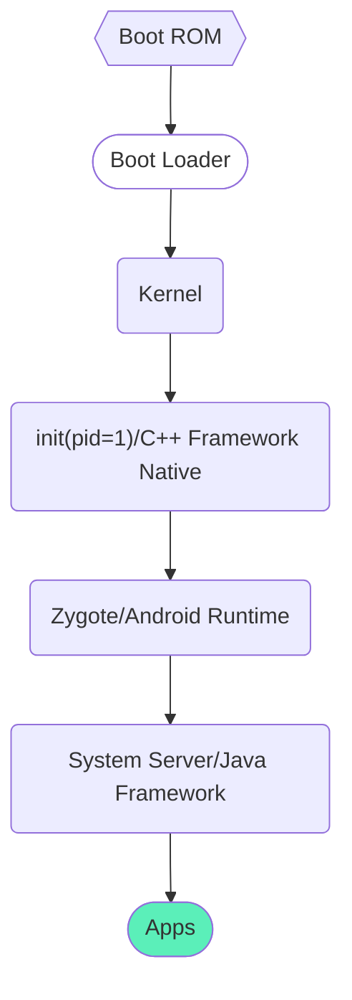
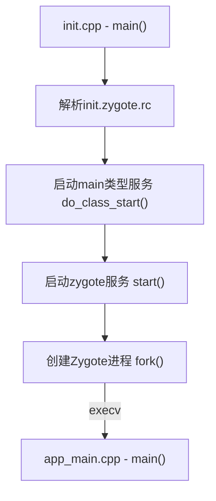
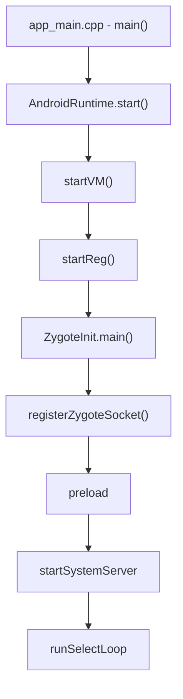
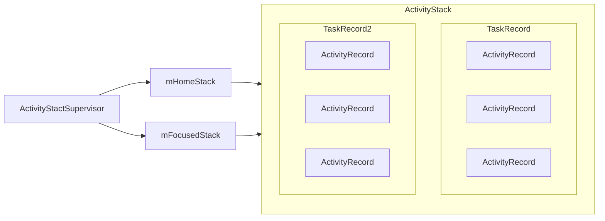

# AMS启动流程

AMS是ActivityManagerService的简称，看名字，似乎是Activity的manager，实际上，它管理的可不只是Activity。

## 系统启动流程

> 面试题：一个应用启动，为什么不从init进程或者SystemServer进程fork，而是从Zygote进程fork。
>
> *因为一个应用运行需要Android运行环境，就需要做一些虚拟机初始化等耗时工作，所以在init进程中进行不合适；而SystemServer又做了太多工作，比如相关的一些系统服务AMS, PMS等，不需要每个应用都运行一套系统服务，所以从SystemServer进程fork也不合适。*

## Zygote集成启动

## System Server进程启动

[SystemServer.java](https://android.googlesource.com/platform/frameworks/base/+/refs/heads/master/services/java/com/android/server/SystemServer.java)

## AMS启动流程

[ActivityManagerService.java](https://android.googlesource.com/platform/frameworks/base/+/master/services/core/java/com/android/server/am/ActivityManagerService.java)

在SystemServer的`startBootstrapServices`方法中，开始了AMS的启动。

### AMS启动过程中做了哪些事？

与`adb shell dumpsys`相关的一些process服务，比如`meminfo`、`gfxinfo`、`dbinfo`等，具体请参考`setSystemProcess`方法。

## Activity启动流程

