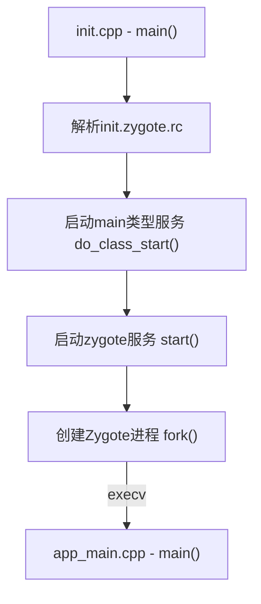

# AMS启动流程

## 系统启动流程

  
Mermaid代码

  <pre>
  <blockcode>
    graph TD;
    style A fill:#fff
    style F fill:#5befb9
    A(Boot Loader) --> B(Kernel);
    B --> C("init(pid=1)");
    C --> D(Zygote/Android Runtime);
    D --> E(System Server);
    E --> F(Apps);
  </blockcode>
  </pre>

## Zygote集成启动

  
Mermaid代码

  <pre>
  <blockcode>
    graph TD;
    A["init.cpp - main()"] --> B[解析init.zygote.rc];
    B --> C["启动main类型服务 do_class_start()"];
    C --> D["启动zygote服务 start()"];
    D --> E["创建Zygote进程 fork()"];
    E --> |execv|F["app_main.cpp - main()"];
  </blockcode>
  </pre>

## System Server进程启动

