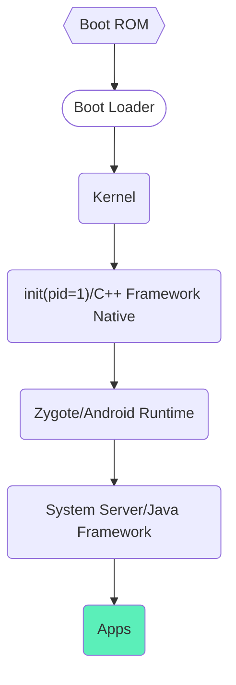
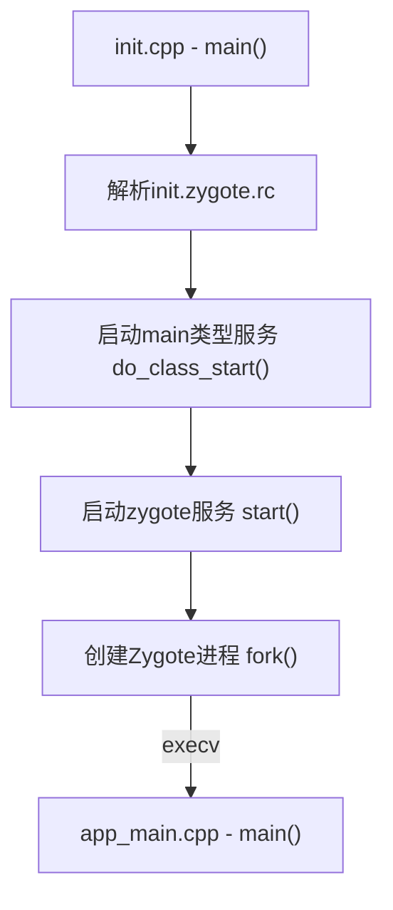
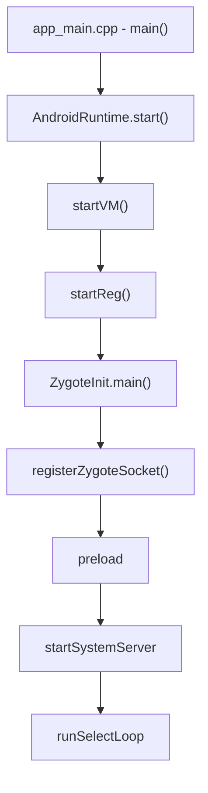
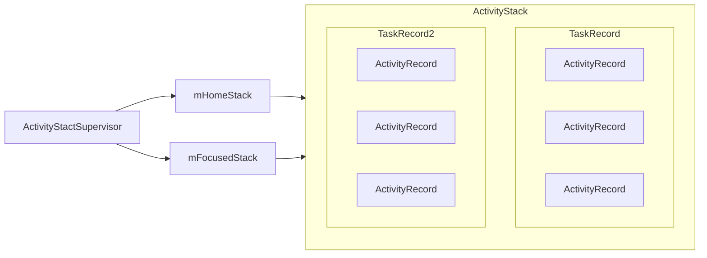
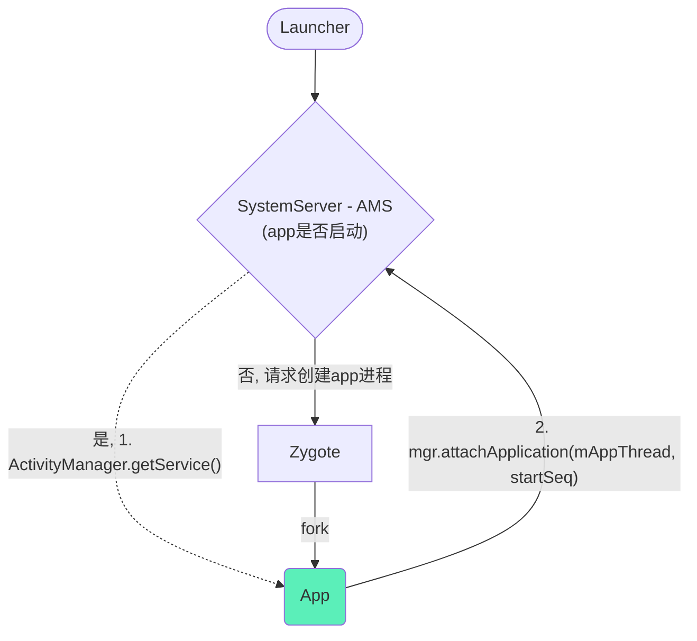
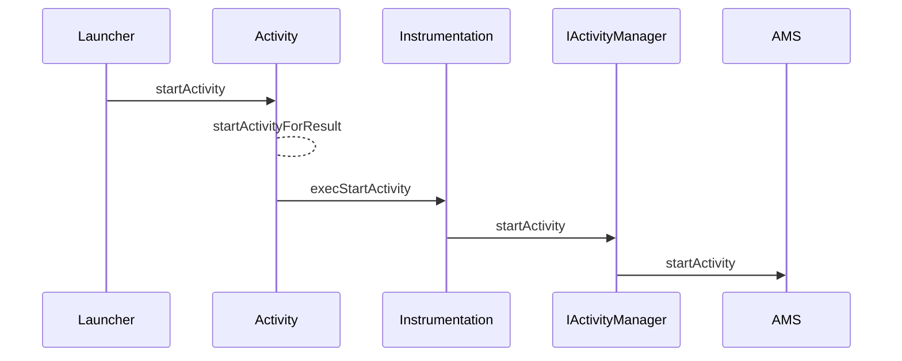
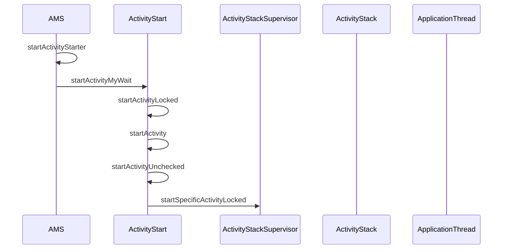

# AMS启动流程

AMS是ActivityManagerService的简称，看名字，似乎是Activity的manager，实际上，它管理的可不只是Activity。

## 系统启动流程

> **面试题：一个应用启动，为什么不从init进程或者SystemServer进程fork，而是从Zygote进程fork。**
>
> *Zygote作为一个孵化器，可以提前加载一些资源，这样fork时给予[Copy-on-Write](https://zhuanlan.zhihu.com/p/48147304)机制创建的其他进程能够直接利用这些资源，而不用重新加载。比如system_server就可以直接使用Zygote中的JNI函数、共享库、常用的类以及主题资源。*
>
> *SystemServer相比Zygote多运行了AMS、WMS等服务，这些对于一个应用程序来说是不需要的，另外fork对多线程不友好，仅会将发起调用的线程拷贝到子进程，这可能会导致死锁，而SystemServer中肯定是有很多多线程的。*
>
> **如何导致死锁的？**
>
> 在POSIX标准中，fork行为是这样的：赋值整个用户空间的数据（通常使用copy-on-write的策略，所以可以实现速度很快）以及所有系统对象，然后仅复制当前线程到子进程。这里：所有父进程中别的线程，到了子进程都是突然蒸发掉的。
>
> 对于锁来说，从OS看，每个锁都有一个所有者，即最后依次lock它的线程。假设这样一个环境，在fork之前，有一个子线程lock了某个锁，获得了对锁的所有权，fork以后，在子进程中，所有的额外线程都人间蒸发了，而锁却被正常赋值了，在子进程看来，这个锁没有主人，所以没有任何人可以对它解锁，当子进程中的某个线程想lock这个锁时候，不再有任何手段可以解开了，程序发生死锁。

## Zygote集成启动

## System Server进程启动

[SystemServer.java](https://android.googlesource.com/platform/frameworks/base/+/refs/heads/master/services/java/com/android/server/SystemServer.java)

## AMS启动流程

[ActivityManagerService.java](https://android.googlesource.com/platform/frameworks/base/+/master/services/core/java/com/android/server/am/ActivityManagerService.java)

在SystemServer的`startBootstrapServices`方法中，开始了AMS的启动。

### AMS启动过程中做了哪些事？

与`adb shell dumpsys`相关的一些process服务，比如`meminfo`、`gfxinfo`、`dbinfo`等，具体请参考`setSystemProcess`方法。

## Activity启动流程

ActivityStactSupervisor

Activity启动简图

> 面试题：Zygote为什么不采用Binder机制进行IPC通信。
>
> Binder机制中存在Binder线程池，是多线程的，如果Zygote采用Binder的话，就存在了上面说的fork多线程死锁问题了。其实严格来说，Binder机制不一定要多线程，所谓的Binder线程只不过是在循环读取Binder驱动消息而已，只注册一个Binder线程也是可以工作的，比如ServiceManager，实际上Zygote尽管没有采用Binder机制，它也不是单线程的，但它在fork前主动停止了其他线程，fork后重新启动了。

Activity启动细节图

**Launcher到AMS阶段**

**AMS到ApplicationThread阶段**

**ApplicationThread到Activity**

