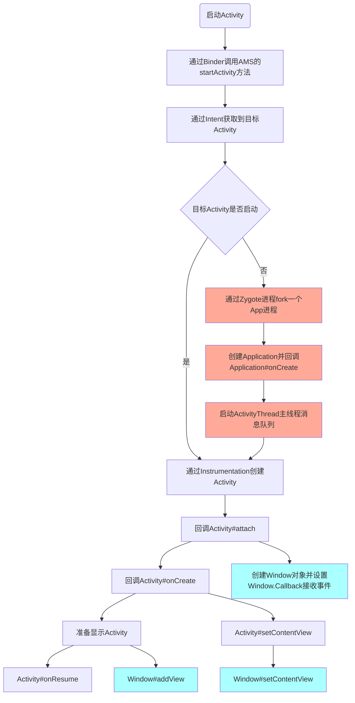

#Activity启动流程

原文参考：[Activity 启动流程分析(Android10)](https://zhuanlan.zhihu.com/p/150283395)

途中浅蓝色部分为WMS关联部分，橙色部分为目标App未启动情况下的流程。

## Intent 解析到 Activity

调用 startActivity 之后，经过几步辗转最终会调用到 **AMS** 中，而 AMS 又会调用 ActivityStarter 来启动 Activity。
解析 Intent 的任务将由`PackageManagerService#resolveIntent`方法来处理。
Intent 匹配规则太负责了，我本意是想学习启动流程，所以就没深入进去看代码，就这样吧。