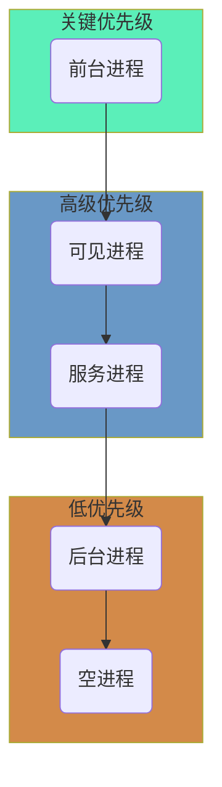

# App保活术


**为什么要保活？**

因为Android的Low memory killer机制，在系统内存不足的情况下，系统开始根据自身的一套进程回收机制结束一些进程，以便腾出内存给需要的进程。


**如何判断内存不足？**

判断的阈值在不同手机上是不一样的，一旦低于该阈值，系统就会杀死对应优先级的进程。

在adb shell下，通过如下命令来查看阈值：

```powershell
cat /sys/module/lowmemorykiller/parameters/minfree
```

*注意: 这可能需要root手机。*

返回的结果如下示例：

```powershell
18432, 23040, 27648, 32256, 55296, 80640
```

其单位为4kb，也就是内存1页大小。

该值表示的是剩余内存大小，优先级为从高到低，比如当内存小于18432*4kb时，杀死对应的优先级的进程。





优先级从高到低依次是，`前台进程`、`可见进程`、`服务进程`、`后台进程`、`空进程`。


**阈值有6个数，而进程有5种优先级，是如何对应呢？**

实际上，第5个数是ContentProvider的阈值，其他的5个数与线程优先级对应。


**如何判断线程的优先级？**

```powershell
cat /proc/<pid>/oom_adj
```

> 其中的<pid>应替换为对应的**进程ID**，从logcat中可以查看对应的pid。


取值范围绿色代表比较安全，红色代表比较容易被杀死，白色代表为系统进程。


## 1像素保活

监听锁屏广播，当屏幕关闭，偷偷创建一个1像素的activity，当屏幕开启，关闭掉这个1像素activity。

关键代码如下:

`ScreenObserverService.java`

```java
//创建后台service，监听屏幕事件。
IntentFilter filter = new IntentFilter(Intent.ACTION_SCREEN_ON);
filter.addAction(Intent.ACTION_SCREEN_OFF);
registerReceiver(theReceiver, filter);
//别忘了在service结束时候，注销掉这个receiver。
```

`OnePixelActivity.java`

```java
Window window = getWindow();
window.setGravity(Gravity.START | Gravity.TOP);
WindowManager.LayoutParams params = window.getAttributes();
params.width = 1;
params.height = 1;
params.x = 0;
params.y = 0;
window.setAttributes(params);
```

别忘了在Manifest文件中，为这个activity设置一个透明主题。

```xml
<activity android:name=".onepixel.OnePixelActivity"
            android:excludeFromRecents="true"
            android:taskAffinity="com.github.boybeak.livestock.onepixel"
            android:theme="@style/OnePixelTheme"
            />
```

> android:excludeFromRecents="true" //不会出现在任务管理器中
>
> android:taskAffinity="xxxx"				//在新的任务栈中创建，不会将其他界面带到前台，配合启动OnePixelActivity时候的Intent.FLAG_ACTIVITY_NEW_TASK使用.

> **注意**：经过实验，这个方案在真机上已经大概率失效了。
>
> 1. 收到锁屏广播会有1~3秒延迟；
> 2. 当OnePixelActivity设置了`excludeFromRecents="true"`后，在锁屏下是启动不起来的；
> 3. 屏幕重新点亮的广播会有十几秒延迟。
>
> 我在一架5T上实验的，其他机型不保证。

## 前台服务

这一方案就是利用一个前台服务，配合Notification，来达到保活。弊端就是，当你的应用没有Notification需求的时候，对于一些敏感用户来说，这就容易引起方案。如下图。


所以当你的应用是音乐类播放器，可以将这个通知作为音乐播放控制来使用，但是如果你的应用没有这样的需求，就会引起敏感用户注意，反而有可能被手动杀死甚至卸载。在Android8.0以前，可以通过如下方案消除这个无意义的敏感通知。

```java
public class OuterService extends Service {
  @Override
  public void onCreate() {
    startForground(1, new Notification());
    startService(new Intent(this, InnerService.class));
  }
  
  public static class InnerService extends Service {
    @Override
    public void onCreate() {
      startForground(1, new Notification());
      stopSelf();
    }
  }
  
}
```

这是利用系统漏洞来消除的这个通知，但是在Android8.0以后，同一个ID下，不允许重复创建前台服务，所以使用该方法需要判断版本。


## 系统广播拉活

**系统拉活**

比如开机广播，电量变化，信号变化，网络变化等。但是在Android7.0后增加了限制，在Android8.0后限制更加严格。所以，这类保活方案已经不可靠了。

> Oreo: https://developer.android.google.cn/about/versions/oreo/background.html#Broadcasts
>
> Pie: https://developer.android.google.cn/guide/components/broadcast-exceptions.html

**用户拉活**

大厂的多个APP之间可以互相之间拉活。 


## Service系统机制拉活

根据Service的onStartCommand方法的返回值，系统会执行不同的拉活方案。一般按照默认返回[START_STICKY](https://developer.android.com/reference/android/app/Service#START_STICKY)就可以。

优点是使用成本低，缺点是不稳定。


## 账户同步拉活

优点：非常稳定。


## JobScheduler拉活


## 双进程守护


## WorkManager


## 厂商推送


## 播放无声音乐


## 白名单

## Github

[示例代码Livestock](https://github.com/boybeak/Livestock)

## 参考文章

[解读Android进程优先级ADJ算法](http://gityuan.com/2018/05/19/android-process-adj/)

[创建自定义账号类型](https://developer.android.com/training/id-auth/custom_auth)

