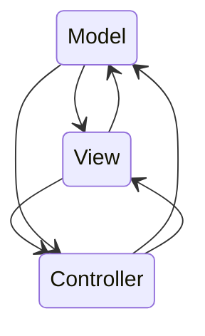

# MVC

Android中的MVC实际上非常混乱，Activity实际上本身是**controller**的角色，但是同时又充当了**model**和**view**。如果这样写，项目小的时候还可以，但是当项目越来越大的时候，为了能更好的解耦，为了适配将来的更改，需要引入**MVP**或者**MVVM**。

需要注意的是，一个项目中，并不是只能有一种开发模式，在不同功能模块完全可以用不同模式，甚至可以混用。

