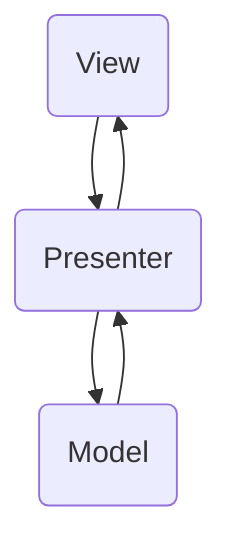

# MVP究极进化

[MVP demo](https://github.com/boybeak/MVP)



MVP通过一个在**view**与**model**层中间架设一个**presenter**层，实现view与model的解耦，这样*数据的归数据，界面的归界面*。

对于Android而言，Activity就只作为view存在，只需要知道自己要怎么更新UI就好了，不需要知道如何请求数据等操作，而model只管请求数据等操作，他们中间靠一个presenter连接，互相不需要知道对方的存在。

这样做的好处显而易见，就是解耦，但是坏处就是，从以前mvc的一个类变成至少三个类，如果产品设计规范设计的好，修改起来也是很容易，但是如果产品规范设计的不好，就会陷入频繁更改，而且更改时候会更繁琐。

为了能更好的绑定View、Model和Presenter三者的关系，我们通常还会需要一个第四者——**Contact**。这样做的目的，是为了编码方便，能一目了然的看出到底是那些View、Model和Presenter存在“契约”关系。

```java
public interface IUserContact {
  public interface IUserView {
    void showUser(User user);
  }
  public interface IUserPresenter<IUserView, IUserModel> {
  }
  public interface IUserModel {
    void getUser();
  }
}
```

一般结构如上，一目了然的，通过IUserContact将IUserView、IUserPresenter和IUserModel绑定了起来，注意其中的IUserPresenter的泛型结构。

上边只显示了一组与User有关的mvp结构，如果又有其他的mvp结构呢？我们为了能够更好的适应不同场景，会把M、V、P三方进行抽象，如下：

```java
public interface IView {
  Context getContext();
}
public interface IModel {
}
public interface IPresenter<V extends IView, M extends IModel> {
  void attachView(V v);
  void detachView();
  V getView();
}
```

所以上面的User相关的mvp结构应该改成如下：

```java
public interface IUserContact {
  public interface IUserView extends IView{
    void showUser(User user);
  }
  public interface IUserModel extends IModel{
    
  }
  public class IUserPresenter<IUserView, IUserModel> {
		void getUser(){...}
  }
}
```

其实，IPresenter的那几个方法，几乎每个Presenter实现类，几乎都差不多，所以我们封装一个BasePresenter类，将这几个基本方法实现了。

```java
public class BasePresenter<V extends IView, M extends IModel> implements IPresenter<V, M> {
  private V view;
  private M model;
  
  public void attachView(V v) {
    this.view = v;
    model = ...;
  }
  public void detachView() {
    this.view = null;
  }
  
  public V getView() {
    return view;
  }
  
}
```

这样，上面的IUserPresenter继承BasePresenter后就可以专心做获取user的工作了。

```java
public class IUserPresenter<IUserView, IUserModel> extends BasePresenter<IUserView, IUserModel>{
		void getUser() {
      asyncGetUser(new OnUserGetListener(){
        public void onGetUser(User user) {
          if (getView() != null) {
            getView().showUser(user);
          }
        }
      })
    }
}
```

这样每个Presenter类就专注于自己的业务就好了，可是这里还是有问题：**内存泄漏**与**频繁空判断**。

想象这样一个场景，IUserPresenter中不止有获取用户基本信息的操作，还有获取个人主页的最近照片、最近状态等操作，那每次等到结果时候，都要进行`getView != null`的判断，因为可能用户在刚刚进入这个界面，没有等到网络请求结果，又马上退出去了，这样view就被detachView方法置空了。

那如果view不置为null行不行？**当然不行**，这会引起内存泄漏的。

接下来的改造，目的就明确了，**避免内存泄漏**+**避免频繁空判断**。要实现这样的目的，需要引入动态代理。我们对BasePresenter类进行进一步改造。

```java
public class BasePresenter<V extends IView, M extends IModel> implements IPresenter<V, M> {

    private static final String TAG = BasePresenter.class.getSimpleName();

    private WeakReference<V> viewReference;
    private V proxyView;

    @SuppressWarnings("unchecked")
    @Override
    public void attachView(V v) {
        viewReference = new WeakReference<>(v);
        proxyView = (V) Proxy.newProxyInstance(v.getClass().getClassLoader(), v.getClass().getInterfaces(),
                new InvocationHandler() {
                    @Override
                    public Object invoke(Object proxy, Method method, Object[] args) throws Throwable {
                        Log.v(TAG, "run by proxy");
                        if (viewReference != null && viewReference.get() != null) {
                            return method.invoke(viewReference.get(), args);
                        }
                        return null;
                    }
                });
    }

    @Override
    public void detachView() {
        viewReference.clear();
        viewReference = null;
    }

    @Override
    public V getView() {
        return proxyView;
    }
}
```

通过**动态代理**，我们会先判断原始view是否为空，不为空，则通过view去执行相对应的方法，这样就规避了频繁的空判断，同时又可以避免activity的内存泄漏。


接下来我们开始对model开刀，我们为**BasePresenter**通过**反射**自动创建model。修改后如下：

```java
public class BasePresenter<V extends IView, M extends IModel> implements IPresenter<V, M> {

    private static final String TAG = BasePresenter.class.getSimpleName();

    private WeakReference<V> viewReference;
    private V proxyView;
    private M m;

    @SuppressWarnings("unchecked")
    @Override
    public void attachView(V v) {
        viewReference = new WeakReference<>(v);
        proxyView = (V) Proxy.newProxyInstance(v.getClass().getClassLoader(), v.getClass().getInterfaces(),
                new InvocationHandler() {
                    @Override
                    public Object invoke(Object proxy, Method method, Object[] args) throws Throwable {
                        Log.v(TAG, "run by proxy");
                        if (viewReference != null && viewReference.get() != null) {
                            return method.invoke(viewReference.get(), args);
                        }
                        return null;
                    }
                });

        ParameterizedType type = (ParameterizedType)this.getClass().getGenericSuperclass();
        if (type != null) {
            Type[] types = type.getActualTypeArguments();
            try {
                m = (M)((Class<?>)types[1]).newInstance();
            } catch (IllegalAccessException | InstantiationException e) {
                e.printStackTrace();
            }
        }

    }

    @Override
    public void detachView() {
        viewReference.clear();
        viewReference = null;
    }

    @Override
    public V getView() {
        return proxyView;
    }

    protected M getModel() {
        return m;
    }
}
```

主要是为BasePresenter添加了getModel方法，为了让view层无法感知到model，需要将这个方法的修饰符设置为`protected`。重点方法还是在attachView方法中，动态代理下边的代码，我们通过反射，生成了这个model对象，当然，这样做也比较局限，就是model类必须有一个空的构造方法才行。

**既然model可以通过反射来生成，那么presenter能否通过反射来生成呢？**当然也可以！我们创建一个Annotation类——**@AutoPresenter**，来标记需要自动生成的类。

再创建一个BaseActivity如下：

```java
public class BaseActivity<P extends IPresenter> extends AppCompatActivity implements IView {
    private P presenter;

    @Override
    protected void onCreate(@Nullable Bundle savedInstanceState) {
        super.onCreate(savedInstanceState);

        presenter = findPresenter();
        presenter.attachView(this);
    }

    @Override
    protected void onDestroy() {
        super.onDestroy();
        presenter.detachView();
    }

    private P findPresenter() {
        Field[] fields = this.getClass().getDeclaredFields();
        if (fields != null) {
            for (Field f : fields) {
                if (f.getAnnotation(AutoPresenter.class) != null) {
                    try {
                        P p = (P)f.getType().newInstance();
                        f.setAccessible(true);
                        f.set(this, p);
                        return p;
                    } catch (IllegalAccessException e) {
                        e.printStackTrace();
                    } catch (InstantiationException e) {
                        e.printStackTrace();
                    }
                }
            }
        }
        return null;
    }

    protected P getPresenter() {
        return presenter;
    }

}
```

在findPresenter方法中，通过反射生成了presenter的对象，这样做的缺点也是显而易见的，就是presenter类必须有一个无参数构造对象。

如果不想用注解反射的方式，也可以参考demo项目中的BaseMVPActivity。