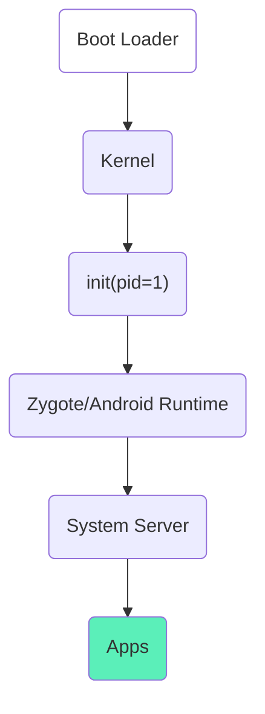

# AMS启动流程

系统启动流程

```mermaid
graph TD;
style A fill:#fff
style F fill:#5befb9
A(Boot Loader) --> B(Kernel);
B --> C("init(pid=1)");
C --> D(Zygote/Android Runtime);
D --> E(System Server);
E --> F(Apps);
```

