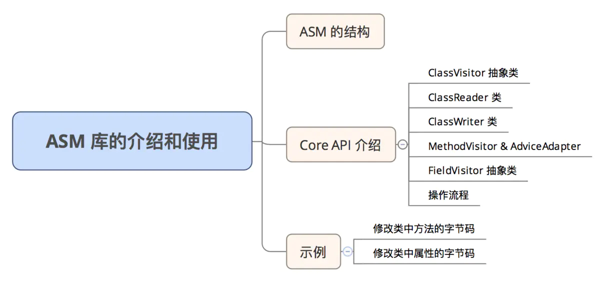

# ASM库介绍与使用

> [原文](https://www.jianshu.com/p/905be2a9a700)

前面几篇文章介绍了 .class 文件的结构、JVM 如何加载 .class 文件、JVM 中如何执行方法的调用和访问者模式，其实前面几篇文章都是为这篇文章做铺垫的，如果不知道 .class 文件结构、也不知道在 JVM 中 .class 文件中的方法是如何被执行的，这篇文章中的有些部分可能会看不懂，所以推荐先看下前面几篇文章。
 这篇文章主要介绍 ASM 库的结构、主要的 API，并且通过两个示例说明如何通过 ASM 修改 .class 文件中的方法和属性。




catalog.png

### 一. ASM 的结构

ASM 库是一款基于 Java 字节码层面的代码分析和修改工具。ASM 可以直接生产二进制的 class 文件，也可以在类被加载入 JVM 之前动态修改类行为。
 ASM 库的结构如下所示：


asm_arch.png

- Core：为其他包提供基础的读、写、转化Java字节码和定义的API，并且可以生成Java字节码和实现大部分字节码的转换，在 [访问者模式和 ASM](https://www.jianshu.com/p/e4b8cb0b3204) 中介绍的几个重要的类就在 Core API 中：ClassReader、ClassVisitor 和 ClassWriter 类.
- Tree：提供了 Java 字节码在内存中的表现
- Commons：提供了一些常用的简化字节码生成、转换的类和适配器
- Util：包含一些帮助类和简单的字节码修改类，有利于在开发或者测试中使用
- XML：提供一个适配器将XML和SAX-comliant转化成字节码结构，可以允许使用XSLT去定义字节码转化

### 二. Core API 介绍

#### 2.1 ClassVisitor 抽象类

如下所示，在 ClassVisitor 中提供了和类结构同名的一些方法，这些方法会对类中相应的部分进行操作，而且是有顺序的：visit [ visitSource ] [ visitOuterClass ] ( visitAnnotation | visitAttribute )* (visitInnerClass | visitField | visitMethod )* visitEnd


```java
public abstract class ClassVisitor {

        ......
    
    public void visit(int version, int access, String name, String signature, String superName, String[] interfaces);
    public void visitSource(String source, String debug);
    public void visitOuterClass(String owner, String name, String desc);
    public AnnotationVisitor visitAnnotation(String desc, boolean visible);
    public AnnotationVisitor visitTypeAnnotation(int typeRef, TypePath typePath, String desc, boolean visible);
    public void visitAttribute(Attribute attr);
    public void visitInnerClass(String name, String outerName, String innerName, int access);
    public FieldVisitor visitField(int access, String name, String desc, String signature, Object value);
    public MethodVisitor visitMethod(int access, String name, String desc, String signature, String[] exceptions);
    public void visitEnd();
}
```

1. void visit(int version, int access, String name, String signature, String superName, String[] interfaces)
    该方法是当扫描类时第一个调用的方法，主要用于类声明使用。下面是对方法中各个参数的示意：visit( 类版本 , 修饰符 , 类名 , 泛型信息 , 继承的父类 , 实现的接口)
2. AnnotationVisitor visitAnnotation(String desc, boolean visible)
    该方法是当扫描器扫描到类注解声明时进行调用。下面是对方法中各个参数的示意：visitAnnotation(注解类型 , 注解是否可以在 JVM 中可见)。
3. FieldVisitor visitField(int access, String name, String desc, String signature, Object value)
    该方法是当扫描器扫描到类中字段时进行调用。下面是对方法中各个参数的示意：visitField(修饰符 , 字段名 , 字段类型 , 泛型描述 , 默认值)
4. MethodVisitor visitMethod(int access, String name, String desc, String signature, String[] exceptions)
    该方法是当扫描器扫描到类的方法时进行调用。下面是对方法中各个参数的示意：visitMethod(修饰符 , 方法名 , 方法签名 , 泛型信息 , 抛出的异常)
5. void visitEnd()
    该方法是当扫描器完成类扫描时才会调用，如果想在类中追加某些方法

#### 2.2 ClassReader 类

这个类会将 .class 文件读入到 ClassReader 中的字节数组中，它的 accept 方法接受一个 ClassVisitor 实现类，并按照顺序调用 ClassVisitor 中的方法

#### 2.3 ClassWriter 类

ClassWriter 是一个 ClassVisitor 的子类，是和 ClassReader 对应的类，ClassReader 是将 .class 文件读入到一个字节数组中，ClassWriter 是将修改后的类的字节码内容以字节数组的形式输出。

#### 2.4 MethodVisitor & AdviceAdapter

MethodVisitor 是一个抽象类，当 ASM 的 ClassReader 读取到 Method 时就转入 MethodVisitor 接口处理。
 AdviceAdapter 是 MethodVisitor 的子类，使用 AdviceAdapter 可以更方便的修改方法的字节码。
 AdviceAdapter 的方法如下所示：


AdviceAdapter.png

其中比较重要的几个方法如下：

1. void visitCode()：表示 ASM 开始扫描这个方法
2. void onMethodEnter()：进入这个方法
3. void onMethodExit()：即将从这个方法出去
4. void onVisitEnd()：表示方法扫码完毕

#### 2.5 FieldVisitor 抽象类

FieldVisitor 是一个抽象类，当 ASM 的 ClassReader 读取到 Field 时就转入 FieldVisitor 接口处理。和分析 MethodVisitor 的方法一样，也可以查看源码注释进行学习，这里不再详细介绍

#### 2.6 操作流程

1. 需要创建一个 ClassReader 对象，将 .class 文件的内容读入到一个字节数组中
2. 然后需要一个 ClassWriter 的对象将操作之后的字节码的字节数组回写
3. 需要事件过滤器 ClassVisitor。在调用 ClassVisitor 的某些方法时会产生一个新的 XXXVisitor 对象，当我们需要修改对应的内容时只要实现自己的 XXXVisitor 并返回就可以了

### 三. 示例

#### 3.1 修改类中方法的字节码

假如现在我们有一个 HelloWorld 类，如下


```java
package com.lijiankun24.asmpractice.demo;

public class HelloWorld {

    public void sayHello() {
        try {
            Thread.sleep(2 * 1000);
        } catch (InterruptedException e) {
            e.printStackTrace();
        }
    }
}
```

通过 `javac HelloWorld.java` 和 `javap -verbose HelloWorld.class` 可以查看到 sayName() 方法的字节码如下所示：


```cpp
  public void sayHello();
    descriptor: ()V
    flags: ACC_PUBLIC
    Code:
      stack=2, locals=2, args_size=1
         0: ldc2_w        #2                  // long 2000l
         3: invokestatic  #4                  // Method java/lang/Thread.sleep:(J)V
         6: goto          14
         9: astore_1
        10: aload_1
        11: invokevirtual #6                  // Method java/lang/InterruptedException.printStackTrace:()V
        14: return
      Exception table:
         from    to  target type
             0     6     9   Class java/lang/InterruptedException
      LineNumberTable:
        line 5: 0
        line 8: 6
        line 6: 9
        line 7: 10
        line 9: 14
      StackMapTable: number_of_entries = 2
        frame_type = 73 /* same_locals_1_stack_item */
          stack = [ class java/lang/InterruptedException ]
        frame_type = 4 /* same */
```

我们通过 ASM 修改 HelloWorld.class 字节码文件，实现统计方法执行时间的功能


```java
public class CostTime {

    public static void main(String[] args) {
        redefinePersonClass();
    }

    private static void redefinePersonClass() {
        String className = "com.lijiankun24.asmpractice.demo.HelloWorld";
        try {
            InputStream inputStream = new FileInputStream("/Users/lijiankun/Desktop/HelloWorld.class");
            ClassReader reader = new ClassReader(inputStream);                               // 1. 创建 ClassReader 读入 .class 文件到内存中
            ClassWriter writer = new ClassWriter(reader, ClassWriter.COMPUTE_MAXS);                 // 2. 创建 ClassWriter 对象，将操作之后的字节码的字节数组回写
            ClassVisitor change = new ChangeVisitor(writer);                                        // 3. 创建自定义的 ClassVisitor 对象
            reader.accept(change, ClassReader.EXPAND_FRAMES);                                       // 4. 将 ClassVisitor 对象传入 ClassReader 中

            Class clazz = new MyClassLoader().defineClass(className, writer.toByteArray());
            Object personObj = clazz.newInstance();
            Method nameMethod = clazz.getDeclaredMethod("sayHello", null);
            nameMethod.invoke(personObj, null);
            System.out.println("Success!");
            byte[] code = writer.toByteArray();                                                               // 获取修改后的 class 文件对应的字节数组
            try {
                FileOutputStream fos = new FileOutputStream("/Users/lijiankun/Desktop/HelloWorld2.class");    // 将二进制流写到本地磁盘上
                fos.write(code);
                fos.close();
            } catch (IOException e) {
                e.printStackTrace();
            }
        } catch (Exception e) {
            e.printStackTrace();
            System.out.println("Failure!");
        }
    }

    static class ChangeVisitor extends ClassVisitor {

        ChangeVisitor(ClassVisitor classVisitor) {
            super(Opcodes.ASM5, classVisitor);
        }

        @Override
        public MethodVisitor visitMethod(int access, String name, String desc, String signature, String[] exceptions) {
            MethodVisitor methodVisitor = super.visitMethod(access, name, desc, signature, exceptions);
            if (name.equals("<init>")) {
                return methodVisitor;
            }
            return new ChangeAdapter(Opcodes.ASM4, methodVisitor, access, name, desc);
        }
    }

    static class ChangeAdapter extends AdviceAdapter {
        private int startTimeId = -1;

        private String methodName = null;

        ChangeAdapter(int api, MethodVisitor mv, int access, String name, String desc) {
            super(api, mv, access, name, desc);
            methodName = name;
        }

        @Override
        protected void onMethodEnter() {
            super.onMethodEnter();
            startTimeId = newLocal(Type.LONG_TYPE);
            mv.visitMethodInsn(INVOKESTATIC, "java/lang/System", "currentTimeMillis", "()J", false);
            mv.visitIntInsn(LSTORE, startTimeId);
        }

        @Override
        protected void onMethodExit(int opcode) {
            super.onMethodExit(opcode);
            int durationId = newLocal(Type.LONG_TYPE);
            mv.visitMethodInsn(INVOKESTATIC, "java/lang/System", "currentTimeMillis", "()J", false);
            mv.visitVarInsn(LLOAD, startTimeId);
            mv.visitInsn(LSUB);
            mv.visitVarInsn(LSTORE, durationId);
            mv.visitFieldInsn(GETSTATIC, "java/lang/System", "out", "Ljava/io/PrintStream;");
            mv.visitTypeInsn(NEW, "java/lang/StringBuilder");
            mv.visitInsn(DUP);
            mv.visitMethodInsn(INVOKESPECIAL, "java/lang/StringBuilder", "<init>", "()V", false);
            mv.visitLdcInsn("The cost time of " + methodName + " is ");
            mv.visitMethodInsn(INVOKEVIRTUAL, "java/lang/StringBuilder", "append", "(Ljava/lang/String;)Ljava/lang/StringBuilder;", false);
            mv.visitVarInsn(LLOAD, durationId);
            mv.visitMethodInsn(INVOKEVIRTUAL, "java/lang/StringBuilder", "append", "(J)Ljava/lang/StringBuilder;", false);
            mv.visitMethodInsn(INVOKEVIRTUAL, "java/lang/StringBuilder", "toString", "()Ljava/lang/String;", false);
            mv.visitMethodInsn(INVOKEVIRTUAL, "java/io/PrintStream", "println", "(Ljava/lang/String;)V", false);
        }
    }
}
```

执行结果如下图所示


Class.png

反编译 HelloWorld2.class 文件的内容如下所示


Class1.png

#### 3.2 修改类中属性的字节码

这一节中我们将展示一下如何使用 Core API 对类中的属性进行操作。

假如说，现在有一个 Person.java 类如下所示：


```java
public class Person {
    public String name;
    public int sex;
}
```

我们想为这个类，添加一个 ‘public int age’ 的属性该怎么添加呢？我们会面对两个问题：

1. 该调用 ASM 的哪个 API 添加属性呢？
2. 在何时写添加属性的代码？

接下来，我们就一一解决上面的两个问题？

##### 3.2.1 添加属性的 API

按照我们分析的上述的 2.6 操作流程叙述，需要以下三个步骤：

1. 需要创建一个 ClassReader 对象，将 .class 文件的内容读入到一个字节数组中
2. 然后需要一个 ClassWriter 的对象将操作之后的字节码的字节数组回写
3. 需要创建一个事件过滤器 ClassVisitor。事件过滤器中的某些方法可以产生一个新的XXXVisitor对象，当我们需要修改对应的内容时只要实现自己的XXXVisitor并返回就可以了

在上面三个步骤中，可以操作的就是 ClassVisitor 了。ClassVisitor 接口提供了和类结构同名的一些方法，这些方法可以对相应的类结构进行操作。

在使用 ClassVisitor 添加类属性的时候，只需要添加一句话就可以了：


```java
classVisitor.visitField(Opcodes.ACC_PUBLIC, "age", Type.getDescriptor(int.class), null, null); 
```


visitField.png

##### 3.2.2 添加属性的时机

我们先暂且在 ClassVisitor 的 visitEnd() 方法中写入上面的代码，如下所示


```java
public class Transform extends ClassVisitor {  
  
    public Transform(ClassVisitor cv) {  
        super(cv);  
    }  
  
    @Override  
    public void visitEnd() {  
        cv.visitField(Opcodes.ACC_PUBLIC, "age", Type.getDescriptor(int.class), null, null);  
    }  
} 
```

我们写如下的测试类，测试一下


```java
public class FieldPractice {

    public static void main(String[] args) {
        addAgeField();
    }

    private static void addAgeField() {
        try {
            InputStream inputStream = new FileInputStream("/Users/lijiankun/Desktop/Person.class");
            ClassReader reader = new ClassReader(inputStream);
          
            ClassWriter writer = new ClassWriter(ClassWriter.COMPUTE_MAXS);
          
            ClassVisitor visitor = new Transform(writer);
            reader.accept(visitor, ClassReader.SKIP_DEBUG);

            byte[] classFile = writer.toByteArray();
            MyClassLoader classLoader = new MyClassLoader();
            Class clazz = classLoader.defineClass("Person", classFile);
            Object obj = clazz.newInstance();

            System.out.println(clazz.getDeclaredField("name").get(obj)); //----(1)
            System.out.println(clazz.getDeclaredField("age").get(obj));  //----(2)
        } catch (Exception e) {
            e.printStackTrace();
        }
    }
}
```

其输出入下所示：


visitFieldResult.png

那如果我们尝试在 ClassVisitor#visitField() 方法中添加属性可以吗？我们可以修改 Transform 测试一下：


```java
public class Transform extends ClassVisitor {

    Transform(ClassVisitor classVisitor) {
        super(Opcodes.ASM5, classVisitor);
    }

    @Override
    public FieldVisitor visitField(int access, String name, String desc, String signature, Object value) {
        cv.visitField(Opcodes.ACC_PUBLIC, "age", Type.getDescriptor(int.class), null, null);
        return super.visitField(access, name, desc, signature, value);
    }
}
```

还是使用上面的测试代码测试一下，会有如下的测试结果


visitFieldError.png

在 Person 类中有重复的属性，为什么会报这个错误呢？

分析 ClassVisitor#visitField() 方法可得知，只要访问类中的一个属性，visitField() 方法就会被调用一次，在 Person 类中有两个属性，所以 visitField() 方法就会被调用两次，也就添加了两次 ‘public int age’ 属性，就报了上述的错误，而 visitEnd() 方法只有在最后才会被调用且只调用一次，所以在 visitEnd() 方法中是添加属性的最佳时机

#### 3.3 ASMifier

可能有人会问，我刚开始学，上面例子中那些 ASM 的代码我还不会写，怎么办呢？ASM 官方为我们提供了 [ASMifier](https://asm.ow2.io/#Q10)，可以帮助我们生成这些晦涩难懂的 ASM 代码。

比如，我想通过 ASM 实现统计一个方法的执行时间，该怎么做呢？一般会有如下的代码：


```csharp
package com.lijiankun24.classpractice;

public class Demo {

    public void costTime() {
        long startTime = System.currentTimeMillis();
        // ......
        long duration = System.currentTimeMillis() - startTime;
        System.out.println("The cost time of this method is " + duration + " ms");
    }
}
```

那上面这段代码对应的 ASM 代码是什么呢？我们可以通过以下两个步骤，使用 ASMifier 自动生成：

1. 通过 `javac` 编译该 `Demo.java` 文件生成对应的 `Demo.class` 文件，如下所示


```css
javac Demo.java
```

1. 通过 ASMifier 自动生成对应的 ASM 代码。首先需要在[ASM官网](https://asm.ow2.io/#Q10) 下载 `asm-all.jar` 库，我下载的是最新的 `asm-all-5.2.jar`，然后使用如下命令，即可生成


```java
java -classpath asm-all-5.2.jar org.objectweb.asm.util.ASMifier Demo.class 
```

截图如下：


DemoDump.png

[深入字节码 -- 玩转 ASM-Bytecode 原 荐](https://my.oschina.net/ta8210/blog/163550)
 [美团热更方案ASM实践](http://www.easemob.com/news/729)


43人点赞


[Java 相关]()


作者：lijiankun24
链接：https://www.jianshu.com/p/905be2a9a700
来源：简书
著作权归作者所有。商业转载请联系作者获得授权，非商业转载请注明出处。