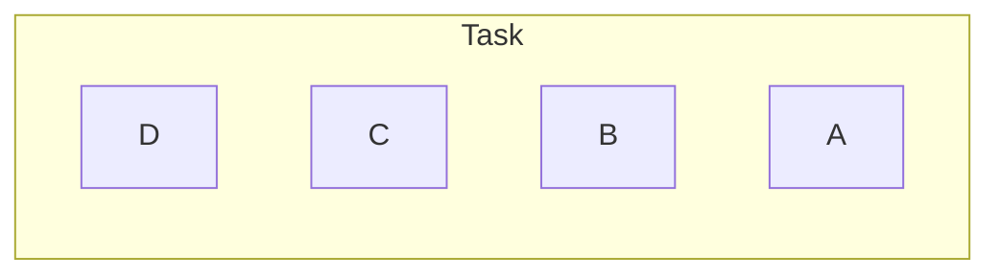
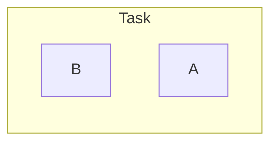

最好先看这一篇[Launch Mode]({{$site.base_url}}/android/LaunchMode.html)。

我们将重点针对**FLAG_ACTIVITY_NEW_TASK**、**FLAG_ACTIVITY_CLEAR_TASK**、**FLAG_ACTIVITY_CLEAR_TOP**、**FLAG_ACTIVITY_SINGLE_TOP**四个flag进行讲解。

[**FLAG_ACTIVITY_NEW_TASK**](https://developer.android.com/reference/android/content/Intent#FLAG_ACTIVITY_NEW_TASK)：

1. 通过非Activity的Context启动一个Activity时候，要使用此flag，比如：ApplicationContext、Service等；
2. 用于Launcher类应用启动其他应用的时候；
3. 当试图通过这个flag启动一个activity的时候，如果后台已经有一个任务栈中有运行的一个此类activity实例，将不会创建一个新的activity，而是将整个栈置于前台，并保持上次的状态。比如从另一个应用启动这种场景，或者Notification中。
4. 如果你想使用startActivityForResult，则**千万不要**在启动的intent添加这个flag。因为onActivityResult回调方法，不会在目标activity执行finish后调用，而是在启动目标activity的时候直接调用，并且收r到resultCode = `RESULT_CANCELED`。

[**FLAG_ACTIVITY_CLEAR_TOP**](https://developer.android.com/reference/android/content/Intent#FLAG_ACTIVITY_CLEAR_TOP)：

1. 如果在当前任务栈中已经有了目标类型activity，则再次通过添加了此flag的intent去启动此类型activity，会有两种情况。
   
   比如有如下图示结构的任务栈:

   此时D通过一个添加了`FLAG_ACTIVITY_CLEAR_TOP`的intent去启动了B类型Activity，则C、D执行onDestroy出栈（不会执行finish，触发onDestroy），现在B在栈顶，有如下图示：

   接下来就有两种情况了。

   情况一：intent中**没有**同时设置`FLAG_ACTIVITY_SINGLE_TOP`，并且B的launchMode是默认值。

   B会finish掉再re-create一个新的B'放在B的位置上。

   情况二：intent中设置了`FLAG_ACTIVITY_SINGLE_TOP`或者是其他类型的launchMode。

   B不会finish（调用finish方法，onDestroy会被触发）掉，而是直接调用其onNewIntent()方法。

> 或许你认为情况二这与launchMode中的singleTop或者singleTask类似，实则不然，其一，singleTop没有清空压在它上边activity的能力；其二，singleTask收到taskAffinity影响。

2. 与`FLAG_ACTIVITY_NEW_TASK`配合使用。如果想启动一个任务栈的root位置的activity，也就是栈低activity，同时设置这两个值，它会将整个任务栈放置于前台，并且清空其他activit，适用于从Notification启动Activity。

[**FLAG_ACTIVITY_CLEAR_TASK**](https://developer.android.com/reference/android/content/Intent#FLAG_ACTIVITY_CLEAR_TASK)：这个flag很特殊，只能于`FLAG_ACTIVITY_NEW_TASK`配合使用。要启动的目标activity的任务栈如果已经存在并且不为空，则将所有activity出栈（不会调用finish方法，onDestroy会被触发），然后创建一个目标类型activity作为这个栈的root。

[**FLAG_ACTIVITY_SINGLE_TOP**](https://developer.android.com/reference/android/content/Intent#FLAG_ACTIVITY_SINGLE_TOP)：这个flag与launchMode中的singleTop几乎一样，当要启动一个activity时候，如果栈顶就是目标类型activity，则不会创建一个新的activity，而是直接调用栈顶的这个activity的onNewIntent()方法。
