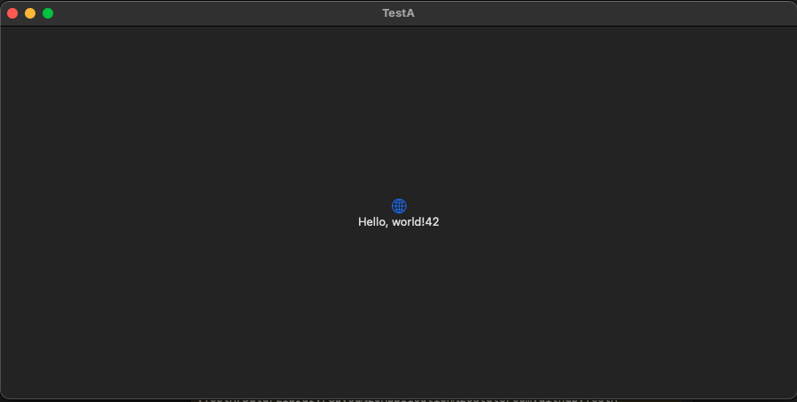

最近在写一款多平台的文件传输工具，Android平台已经写的差不多了，现在正在写macOS端，为了多端共享同一套底层协议代码，通讯协议部分，使用了c语言开发，对于Android通过jni调用c的相关代码，我已经驾轻就熟了，但是在macOS项目里，添加静态库并成功调试，我还是有一些懵逼。好在通过ChatGPT的各种帮助，还是跌跌撞撞的调通了。为了防止遗忘，记录一下过程。

相关的c/swift代码，均以示例项目作为演示，目的是说明过程。

## 一、C语言库

c库的相关代码结构如下：
```css
demo
├── bc
│   ├── bc.h
│   ├── bc.c
│   └── build/libbc.a
│   └── CMakeLists.txt
├── main.c
│── CMakeLists.txt

```
根目录的main.c与CMakeLists.txt不重要，重要的是bc文件夹下。
bc.h为头文件，bc.c为代码文件，其内容比较简单，定义了一个名为getNumber的函数，函数返回值为42，build为编译生成文件夹，主要是为了生成libbc.a，bc目录下的CMakeLists.txt内容如下：
```txt
cmake_minimum_required(VERSION 3.5)
project(bc VERSION 0.0.1)

# 添加库
add_library(
    bc STATIC 
    bc.c bc.h
)

# 将库的目录添加到include路径
target_include_directories(bc PUBLIC ${CMAKE_CURRENT_SOURCE_DIR})
```
这里主要关注`add_library`这个指令中的，`STATIC`关键字，有这个关键字，在编译时，才会被编译成静态库。
在bc目录下，执行相关的指令，生成静态库文件。
```bash
mkdir build
cd build
cmake ..
make
```
执行完相关指令以后，在build目录下，会多一个libbc.a文件。

## 二、macOS swiftUI项目
macOS的演示项目名称为TestA，其基本目录结构如下：
```css
TestA
├── TestA
│   ├── main.swift
│   ├── TestA-Bridging-Header.h
│   └── ...
├── TestA.xcodeproj
|── include/bc.h
└── libbc.a
```
TestA为项目根目录，其内部的TestA为同名Target目录。在根目录下，你可以看到一个libbc.a文件，实际上这个文件本身并不存在于该路径下，而是在上一段中提到的build目录下，当然，你也可以把文件本身拷贝到该目录下。

### 2.1 添加libbc.a
在根目录上，右键->Add Files to "TestA"，然后选择libbc.a，这样libbc.a就会显示在根目录下了。
左键点击项目根目录，弹出配置选项卡，点击**Build Settings**选项卡，在Filter中，输入"Other Linker Flags"，找到该配置项，然后增加配置值`-lbc`（这里的“bc”应该是你的库文件名去掉前缀“lib”和后缀“.a”，因为我的库名称叫bc，生成的文件上libbc.a，所以值为-lbc，如果你的库名称为xyz，则应该配置为-lxyz），这里需要注意，该配置项下有Debug和Release两个，都要配置，下同。

### 2.2 引入头文件
在根目录下，创建include目录，将头文件bc.h拷贝进来。然后在刚才的**Build Settings**选项卡中，搜索"Header Search Paths"，并设置值为`$(SRCROOT)/include`，注意，如果include下有子目录，同样需要添加到该配置中。添加了该配置后，在接下来的TestA-Bridging-Header.h中，才能引入相关头文件。

### 2.3 TestA-Bridging-Header.h
注意，是TestA-Bridging-Header.h，不是TestA-Bridge-Header.h。因为是桥接文件，所以好几次，我都想当然的认为是`Bridge`了，导致很多次配置都失败了。
文件内容如下：
```h
#ifndef TestA_Bridging_Header_h
#define TestA_Bridging_Header_h

#include "bc.h"

#endif
```
在此文件中，可以使用bc.h文件了。

此时，在Swfit代码中还不能使用TestA-Bridge-Header.h中引入头文件的相关函数，需要设置Objective-C Bridging Header，同样在**Build Settings**中搜索"Objective-C Bridging Header"，设置值为`TestA/TestA-Bridging-Header.h`。

## 三、运行
在Swift代码的UI配置文件中，使用c语言中的`getNumber`方法。
```swift
import SwiftUI

struct ContentView: View {
    var body: some View {
        VStack {
            Image(systemName: "globe")
                .imageScale(.large)
                .foregroundStyle(.tint)
            Text("Hello, world!\(getNumber())")
        }
        .padding()
    }
}
```
将该数字显示在Text中，效果如下：
