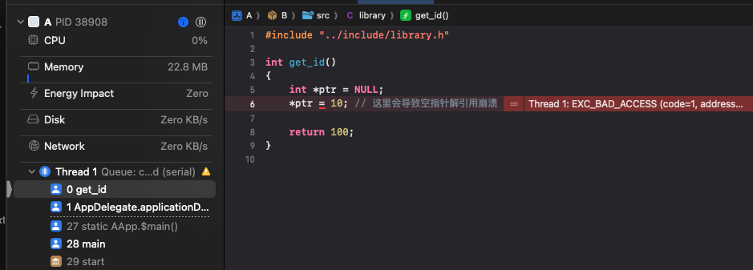

在上一篇文章[macOS项目中引入c静态库](https://boybeak.github.io/2024/04/26/2024-04-26-MacOS%E9%A1%B9%E7%9B%AE%E4%B8%AD%E5%BC%95%E5%85%A5c%E9%9D%99%E6%80%81%E5%BA%93/)中，为阐述了如何在macOS项目中引入c语言的静态库，但是这样做有一个问题，就是静态库中的代码报错，会无法定义报错的位置，进而不利于排查问题。为了解决这个问题，我修改为源码引入c语言库。
很多教程中都提到，要引入c语言库的源码，需要将源码和头文件都拷贝到macOS项目的目录中，这样做，有一个弊病，就是对于需要引入c语言库的项目，通常都是想底层多平台支持，底层代码就需要独立于任何一个平台代码，如果要拷贝到macOS项目中，那后续修改和维护都会比较麻烦，实际上这是不需要的，接下来就阐述一下我这两天的实践。

## 一、项目结构
我们准备两个示例项目，其中项目A是基于swift构建的macOS项目，项目B是基于cmake构建的c语言项目。其目录树如下：
```css
A/
├── A   // macOS中的同名target
│   └── AApp.swift
│   └── ContentView.swift
│   └── Assets
│   └── ....    // Other files
```
```css
B/
├── CMakeLists.txt
├── src/
│   └── library.c
└── include/
    └── library.h
```
library的头文件和代码文件如下：
```h
#include <stdio.h>

int get_id();
```
```c
#include "../include/library.h"

int get_id()
{
    int *ptr = NULL;
    *ptr = 10; // 这里会导致空指针解引用崩溃

    return 100;
}
```
这里c代码文件中，故意制造了一个空指针崩溃，以便于测试定位崩溃位置。

## 二、macOS项目引入c语言源代码项目
在XCode中，A项目的根目录下，右键-Add Files to "A"，然后选择项目B的根目录选择的时候，千万**不要勾选“Copy items if needed”**，然后点击Add，如此操作之后，你会在XCode的项目目录中，看到在根目录下多了一个名为B的Group，但是这个Group并不会出现在实际的文件目录下。那在XCode中，项目A的目录结构变成了如下这样：
```css
A/
├── A   // macOS中的同名target
│   └── AApp.swift
│   └── ContentView.swift
│   └── Assets
│   └── ....    // Other files
│
├── B   // 引入的c源码库，只在XCode视图中可见
│   └── CMakeLists.txt
│   └──src/
│   │   └── library.c
│   └──include/
        └── library.h
```

## 三、创建桥接文件
与静态库方案类似，也需要创建一个桥接文件，名为A-Bridging-Header.h，放置在根目录下，然后在Build Settings下搜索**Header Search Paths**设置项，在Debug和Release下，设置B库的include目录，**注意**：因为B库并未实际在A项目的文件目录下，所以，你不能设置一个A项目下的目录。我设置的值为：`$(SRCROOT)/../B/include`。增加此配置后，在桥接文件中，增加头文件的引入，内容如下：
```h
#ifndef A_Bridging_Header_h
#define A_Bridging_Header_h

#include "library.h"

#endif
```

还差最后一步，把桥接文件设置到**Objective-C Bridging Header**配置中，由于桥接文件在根目录下，所以我设置的值为`A-Bridging-Header.h`。

## 四、运行
在AApp.swift代码中，我们创建一个Application Delegate，代码如下：
```swift
import SwiftUI

@main
struct AApp: App {
    @NSApplicationDelegateAdaptor var delegate: AppDelegate
    var body: some Scene {
        WindowGroup {
            ContentView()
        }
    }
}

class AppDelegate: NSObject, NSApplicationDelegate {
    func applicationDidFinishLaunching(_ notification: Notification) {
        print("applicationDidFinishLaunching")
        print("\(get_id())")
    }
}
```
当应用启动时，调用一下c语言中`get_id`这个方法，由于方法中有一个空指针错误，会触发崩溃，并指向崩溃位置。


## 后记
在现实项目中，c源码项目可能远比demo中的要复杂的多，引入源码后，可能会引起类似于如下的编译错误：
```
xcode macOS项目中，引入了第三方的c语言库后，出现了这样的错误，似乎是因为不能识别这些文件造成的，我把这些文件的引用从xcode删除后，就没有这些错误了，请问情况是这样的吗？以下是错误的内容：
Showing All Issues
Multiple commands produce '/Users/xxx/Library/Developer/Xcode/DerivedData/Test-gkhgciuuhcjhzjayrjomcyvjrhgq/Build/Products/Debug/Test.app/Contents/Resources/CI.yml'
Target 'Test' (project 'Test') has copy command from '/Users/xxx/byte-cat/ByteCat/native/bytecat-native/cJSON/.github/workflows/CI.yml' to '/Users/xxx/Library/Developer/Xcode/DerivedData/Test-gkhgciuuhcjhzjayrjomcyvjrhgq/Build/Products/Debug/Test.app/Contents/Resources/CI.yml'
Target 'Test' (project 'Test') has copy command from '/Users/xxx/byte-cat/ByteCat/native/bytecat-native/libhv/.github/workflows/CI.yml' to '/Users/xxx/Library/Developer/Xcode/DerivedData/Test-gkhgciuuhcjhzjayrjomcyvjrhgq/Build/Products/Debug/Test.app/Contents/Resources/CI.yml'
```
如果发生了这个错误，需要在**Build Phases**中，找到**Copy Bundle Resources**选项，点击底部"-"号按钮，删除掉重复的项，如果重复的项过多，这个按钮会被顶到列表最下边。