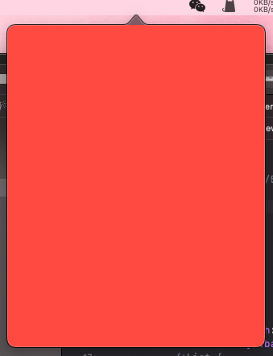
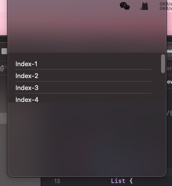
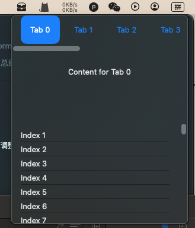

最近想利用闲暇时间，做一些托盘工具类app的开发，主要是方便自己在Mac上的部分操作。在遇到各种问题后，总结了一下实现托盘SwiftUI应用的两种方式。
> 小声吐槽：swiftUI在macOS上的适配真的是很烂，相当多的组件可以说是不完善甚至是不可用的状态，似乎苹果也没有完善的意思，这已经是swift迭代到5.10了啊，竟然还有这么多问题存在。

## 方案一：NSApplicationDelegateAdaptor
这种方式，应该是从Objective-C时代承袭过来的，我没有做过Objective-C的应用，这只是我的猜测。
新建一个项目，通常会生成一个`XXXApp.swift`的文件，文件的内容如下：
```swift
@main
struct XXXApp: App {
    var body: some Scene {
        WindowGroup {
            ContentView()
        }
    }
}
```
我们要添加一行代码，变成如下这样：
```swift
@main
struct ByteCatApp: App {
    @NSApplicationDelegateAdaptor(AppDelegate.self) var appDelegate
    var body: some Scene {
        WindowGroup {
            ContentView()
        }
    }
}
```
加入了`@NSApplicationDelegateAdaptor(AppDelegate.self) var appDelegate`这一行，现在开始写`AppDelegate`的代码。
```swift
class AppDelegate: NSObject, NSApplicationDelegate {
    var statusItem: NSStatusItem!
    var popover: NSPopover!
    
    override init() {}
    
    func applicationDidFinishLaunching(_ notification: Notification) {
        setupStatusBarItem()
        setupPopover()
    }
    
    func setupStatusBarItem() {
        statusItem = NSStatusBar.system.statusItem(withLength: NSStatusItem.squareLength)
        
        if let button = statusItem.button {
            let imageSize = NSSize(width: 22, height: 22)
            button.image = NSImage(named: "TrayIcon")
            button.image?.size = imageSize
            button.action = #selector(togglePopover(_:))
        }
    }
    
    func setupPopover() {
        popover = NSPopover()
        popover.behavior = .transient
        popover.contentViewController = PopoverViewController().makeNSViewController()
    }
    
    @objc func togglePopover(_ sender: AnyObject?) {
        if popover.isShown {
            closePopover(sender)
        } else {
            showPopover(sender)
        }
    }
    
    func showPopover(_ sender: AnyObject?) {
        if let button = statusItem.button {
            popover.show(relativeTo: button.bounds, of: button, preferredEdge: NSRectEdge.minY)
        }
    }
    
    func closePopover(_ sender: AnyObject?) {
        popover.performClose(sender)
    }
    
}

struct PopoverViewController: NSViewControllerRepresentable {
    func makeNSViewController(context: Context) -> NSViewController {
        return makeNSViewController()
    }
    
    func makeNSViewController() -> NSViewController {
        let viewController = NSViewController()
        viewController.view = NSHostingView(rootView: ContentView())
        return viewController
    }
    
    func updateNSViewController(_ nsViewController: NSViewController, context: Context) {
        // Update code if needed
    }
}
```

## 方案二：MenuBarExtra
```swift
@main
struct XXXApp: App {
    var body: some Scene {
        return MenuBarExtra {
            ContentView()
        } label: {
            Image(systemName: "tray.2.fill")
        }.menuBarExtraStyle(.window)
    }
}
```
这个方案就是这么简单，几行代码就搞定，缺点是，弹出的窗口位置不可调整，也不会有一个三角形指向托盘图标的位置，而且窗口位置一直与托盘图标左对齐。

## 问题

### List导致UI异常
方案一，当弹出窗口UI中包含了List组件，会使得弹出的窗口显示异常。
正常情况是这样的：

异常的情况如下：

代码的差别，只是把其中的红色布局换成了List组件而已，顶端的三角指向消失了，而且窗口整体上移了。

### MenuBarExtra的显示不同
使用方案二，窗口弹出是这样的：

同样没有顶部三角指向，固定与托盘图标左对齐。

### 横向滑动列表不支持鼠标滚轮
这并不是某个方案中的问题，而是二者都有的问题，这个应该是SwiftUI的相关组件没有适配macOS所致，这个并没有找到解决办法，似乎苹果也不想解决，毕竟大多数做桌面端app的，都是使用Electron方案，使用原生开发，而且只开发托盘应用的实在是少数。

## 一点小改进
如果你想让托盘应用启动后，只有在托盘中有图标，而在dock栏中没有图标，则需要在Info.plist中，设置一个属性**Application is agent(UIElement)**为YES。

## 总结
swiftUI真的不适合在macOS端开发稍微复杂一点的应用，之前开发过一个翻译的应用，只能说勉强够用而已，前提是足够简单。
对于托盘应用这个极小的领域来说，尤其不能使用，electron不支持自定义UI的弹出窗口，只支持菜单，而swiftUI支持的情况更糟糕，可能只有原始的Objective-C方案可行了，原始人方案。