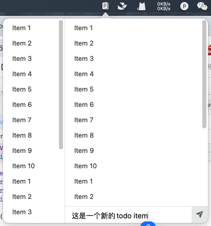

## 一、界面布局
一个简单的界面布局描述如下：
```css
---------------------
|   |               |
|   |               |
|   |               |
| 1 |      2        |
|   |               |
|   |               |
|   |---------------|
|   |      3        |
---------------------
```
简单分为3个区域：
1. 导航 - 用于做Todo Item的分类导航，是一个列表；
2. 内容 - 展示当前分类下的Todo Items；
3. 输入 - 在当前分类下创建新的Todo。

> 这实际上是一个妥协方案，我的理想方案是简单的上中下三部分，上部分上导航，类似于chrome浏览器顶部页面管理那种，但是macOS对于列表横向滑动的滚轮支持实在是太差了，没有找到成熟的方式实现，妥协成当前这样了

## 二、页面构建
[上一章]()中，我们有一个用于展示界面的ViewController类，这次要在其中填充上述的布局内容。
代码可参考[MyTodo](https://github.com/boybeak/MyTodo)，最终实现效果如下：
