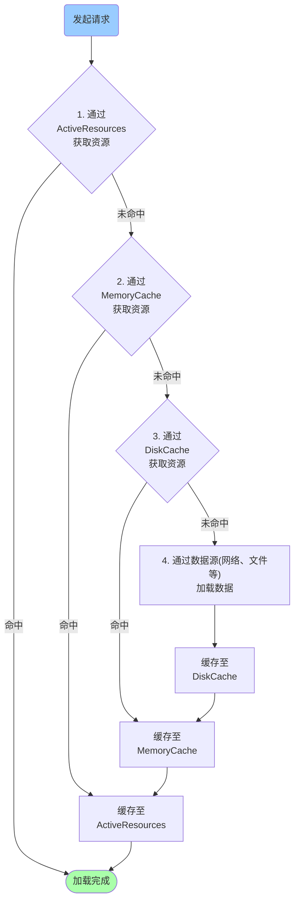

# Glide源码分析与自我实现(二)——缓存与BitmapPool

> 本文基于Glide 4.11.0

参考文章：[Glide 源码分析解读-缓存模块-基于最新版Glide 4.9.0](https://zhuanlan.zhihu.com/p/60426316)

**注意：**由于版本差异问题，本文有些部分与参考文章有差异。

缓存模块是Glide中非常重要的部分，Glide图片加载的高效性，几乎有一半功劳都在这里了。

一般来说，Glide有三级缓存，就是**内存缓存**、**磁盘缓存**和**网络缓存**。

先来看缓存流程图，如下：



##内存缓存

内存缓存主要靠三个部分组成：**ActiveResources**、**MemoryCache**和**BitmapPool**。

###ActiveResources

ActiveResources表示当前正在活动中的资源。ActiveResources通过一个`Map<Key, ResourceWeakReference>`来保存活动中的资源，其中的ResourceWeakReference就是资源数据，在构建这个ResourceWeakReference的时候必须传入一个ReferenceQueue用来检测资源是否被回收。

> **Q1：如何探知WeakReference中的值被回收了呢？**
>
> ```java
> ReferenceQueue queue = ...;
> WeakReference wr = new WeakReference(value, queue);
> ```
>
> 当构建WeakReference的时候，如果传入了queue参数，则在value被回收的时候，wr会被加入到queue中去，这样，通过检测queue中是否有值，就可以探知value是否被回收了。

那么，在何时去探知ReferenceQueue中的值呢？我们查看ActiveResources的关键代码：

```java
/*构造方法中，通过monitorClearedResourcesExecutor执行了cleanReferenceQueue()方法。
*/
ActiveResources(boolean isActiveResourceRetentionAllowed) {
  this(
    isActiveResourceRetentionAllowed,
    java.util.concurrent.Executors.newSingleThreadExecutor(
      new ThreadFactory() {
        @Override
        public Thread newThread(@NonNull final Runnable r) {
          return new Thread(
            new Runnable() {
              @Override
              public void run() {
                Process.setThreadPriority(Process.THREAD_PRIORITY_BACKGROUND);
                r.run();
              }
            },
            "glide-active-resources");
        }
      }));
}

@VisibleForTesting
ActiveResources(
  boolean isActiveResourceRetentionAllowed, Executor monitorClearedResourcesExecutor) {
  this.isActiveResourceRetentionAllowed = isActiveResourceRetentionAllowed;
  this.monitorClearedResourcesExecutor = monitorClearedResourcesExecutor;

  monitorClearedResourcesExecutor.execute(
    new Runnable() {
      @Override
      public void run() {
        cleanReferenceQueue();
      }
    });
}


void cleanReferenceQueue() {
  while (!isShutdown) {
    try {
      ResourceWeakReference ref = (ResourceWeakReference) resourceReferenceQueue.remove();
      cleanupActiveReference(ref);

      // This section for testing only.
      DequeuedResourceCallback current = cb;
      if (current != null) {
        current.onResourceDequeued();
      }
      // End for testing only.
    } catch (InterruptedException e) {
      Thread.currentThread().interrupt();
    }
  }
}
```

我们通过代码可以看出，`cleanReferenceQueue`是一个靠`isShutdown`变量控制的**死循环**方法，这个方法执行在一个优先级为`THREAD_PRIORITY_BACKGROUND`的线程上。

> **Q2：那么，既然是死循环方法，会不会过多的占用CPU资源呢？**
>
> 其实不会的，因为ReferenceQueue#remove是一个阻塞式的方法，如果没有元素可以被remove，则等待至有元素可以remove的时候，等待期间释放CPU。

> **注意：**此处与**参考文章**中的说法不同，这是因为版本差异。查看[Glide update log hsitory](https://github.com/bumptech/glide/commit/8f1ea5c07dff7ade8c49c324bcb5a7f40d0b4891#diff-c46e6c0760c04e74cb867c2bdf9cdee90ab279b119268478524c42cc743cb8a9)，可以看出**出于避免在主线程做清理的原因**，将清理任务放在了后台线程，而不是放在IdleHandler中。


**那么被回收了的资源去哪里了呢？**

我们查看`cleanupActiveReference`方法，得知，通过*ResourceListener#onResourceReleased*回调，交给了**Engine**来处理，我们查看Engine的onResourceReleased方法。

```java
@Override
public void onResourceReleased(Key cacheKey, EngineResource<?> resource) {
  activeResources.deactivate(cacheKey);
  if (resource.isMemoryCacheable()) {
    cache.put(cacheKey, resource);
  } else {
    resourceRecycler.recycle(resource, /*forceNextFrame=*/ false);
  }
}
```

从这里我们发现，这里出现了两种情况：

1. 如果资源是**MemoryCacheable**的，则缓存在MemoryCache；
2. 如果资源不是**MemoryCacheable**的，则交给ResourceRecycler调用Resource的recycle()方法来回收，如果此Resource为BitmapResource，则会将Bitmap回收到BitmapPool中去。


在开始MemoryCache和BitmapPool前，需要先了解一下**MemorySizeCalculator**这个类，这个类是用来计算 BitmapPool 、ArrayPool 以及 MemoryCache **大小**的。

###MemoryCache

MemoryCache的具体实现类是LruResourceCache，而实际的逻辑方法，都在其父类LruCache中，以put方法为例。

```java
@Nullable
public synchronized Y put(@NonNull T key, @Nullable Y item) {
  final int itemSize = getSize(item);
  if (itemSize >= maxSize) {
    onItemEvicted(key, item);
    return null;
  }

  if (item != null) {
    currentSize += itemSize;
  }
  @Nullable Entry<Y> old = cache.put(key, item == null ? null : new Entry<>(item, itemSize));
  if (old != null) {
    currentSize -= old.size;

    if (!old.value.equals(item)) {
      onItemEvicted(key, old.value);
    }
  }
  evict();

  return old != null ? old.value : null;
}
```

当有一个新的item被put进去以后，会替换出一个老的值old，如果old非为空，则需要将当前容量减去old的大小，如果old并非新的item，则需要通过onItemEvicted进行回调，通知有老值被**“驱逐”**了。最后还要执行一次evict方法，按照LRU算法，将超出maxSize的item**“驱逐”**出去，以确保在maxSize范围内。

```java
protected synchronized void trimToSize(long size) {
  Map.Entry<T, Entry<Y>> last;
  Iterator<Map.Entry<T, Entry<Y>>> cacheIterator;
  while (currentSize > size) {
    cacheIterator = cache.entrySet().iterator();
    last = cacheIterator.next();
    final Entry<Y> toRemove = last.getValue();
    currentSize -= toRemove.size;
    final T key = last.getKey();
    cacheIterator.remove();
    onItemEvicted(key, toRemove.value);
  }
}

private void evict() {
  trimToSize(maxSize);
}
```


###BitmapPool

这里是专门用来存放被回收的Bitmap的，其中**BitmapDrawableResource**、**BitmapResource**都持有一个**BitmapPool**变量，在执行recycle()方法时候，调用*BitmapPool#put()*方法。我们来看一下这个BitmapPool的默认实现类**LruBitmapPool**的方法实现。

```java
@Override
public synchronized void put(Bitmap bitmap) {
  if (bitmap == null) {
    throw new NullPointerException("Bitmap must not be null");
  }
  if (bitmap.isRecycled()) {
    throw new IllegalStateException("Cannot pool recycled bitmap");
  }
  if (!bitmap.isMutable()
      || strategy.getSize(bitmap) > maxSize
      || !allowedConfigs.contains(bitmap.getConfig())) {
    if (Log.isLoggable(TAG, Log.VERBOSE)) {
      Log.v(
        TAG,
        "Reject bitmap from pool"
        + ", bitmap: "
        + strategy.logBitmap(bitmap)
        + ", is mutable: "
        + bitmap.isMutable()
        + ", is allowed config: "
        + allowedConfigs.contains(bitmap.getConfig()));
    }
    bitmap.recycle();
    return;
  }

  final int size = strategy.getSize(bitmap);
  strategy.put(bitmap);
  tracker.add(bitmap);
	...
}
```

这里我们可以看出，当Bitmap在三种情况下是不会被BitmapPool缓存起来的：

1. 这个bitmap是非mutable的，也就是说是不允许被复用的；
2. 这一个bitmap的字节数大小已经超过了可以容纳的总大小；
3. BitmapPool中不允许的Config类型。

在这种情况，bitmap就被直接recycle掉，而不是放入缓存等待下次使用。

如果不满足这三种情况，则会被strategy缓存起来，等待下次使用。

我们再看LruBitmapPool#get()方法。

```java
@Override
@NonNull
public Bitmap get(int width, int height, Bitmap.Config config) {
  Bitmap result = getDirtyOrNull(width, height, config);
  if (result != null) {
    result.eraseColor(Color.TRANSPARENT);
  } else {
    result = createBitmap(width, height, config);
  }
  return result;
}
```

我们可以看到，当能够查询到符合条件的Bitmap的时候，会先通过eraseColor方法，将其变成透明图片，然后再交给调用者来使用；如果查询不到，则创建一个新图交给调用者来使用。

> LruBitmapPool的LruPoolStrategy变量，在KITKAT以及以上，是SizeConfigStrategy，在以下是AttributeStrategy，这是因为在KITKAT版本以下，Bitmap的复用需要尺寸的严格匹配，但是KITKAT及以上没有这个问题，只要被复用的图片尺寸比目标尺寸大就可以。


### ArrayPool

ArrayPool主要用在**ThumbnailStreamOpener**和**ByteBufferGifDecoder**中，具体的实现类为**LruArrayPool**。

在LruArrayPool中，通过groupedMap来缓存数据，而缓存数据的byte字节数是通过**ArrayAdapterInterface**来计算的，ArrayAdapterInterface是一个接口，实现类有两个：**IntegerArrayAdapter**和**ByteArrayAdapter**，分别对应缓存int[].class和byte[].class。

StreamGifDecoder和StreamBitmapDecoder都有一个ArrayPool成员。解码过程中需要用到byte[]，但不是直接new byte[]，而是调用`ArrayPool.get()`从对象池中拿，用完了归还。


## DiskCache

在上一章[Glide源码分析与自我实现(一)——数据加载主流程]({{site.base_url}}/源码分析系列/Glide源码分析与自我实现2.md)中，提到过数据加载的主流程，其中一个非常重要的类是 **DecodeJob**，在这个类的`getNextGenerator`方法中，返回的**SourceGenerator**会用来加载远程数据，但是这个方法不止返回这一个**DataFetcherGenerator**类，这是一个通过条件判断，返回不同DataFetcherGenerator类的方法。

```java
private DataFetcherGenerator getNextGenerator() {
  switch (stage) {
    case RESOURCE_CACHE:
      return new ResourceCacheGenerator(decodeHelper, this);
    case DATA_CACHE:
      return new DataCacheGenerator(decodeHelper, this);
    case SOURCE:
      return new SourceGenerator(decodeHelper, this);
    case FINISHED:
      return null;
    default:
      throw new IllegalStateException("Unrecognized stage: " + stage);
  }
}
```

实际上，这是依次递进的**有限状态机**设计模式，当一个获取数据请求到来时候，此时是默认状态INITIALIZE，然后通过`getNextStage`方法判断下一个状态是什么，再按照新的状态获取DataFetcherGenerator，然后随着任务的执行，不断改变状态。

```java
private Stage getNextStage(Stage current) {
  switch (current) {
    case INITIALIZE:
      return diskCacheStrategy.decodeCachedResource()
        ? Stage.RESOURCE_CACHE
        : getNextStage(Stage.RESOURCE_CACHE);
    case RESOURCE_CACHE:
      return diskCacheStrategy.decodeCachedData()
        ? Stage.DATA_CACHE
        : getNextStage(Stage.DATA_CACHE);
    case DATA_CACHE:
      // Skip loading from source if the user opted to only retrieve the resource from cache.
      return onlyRetrieveFromCache ? Stage.FINISHED : Stage.SOURCE;
    case SOURCE:
    case FINISHED:
      return Stage.FINISHED;
    default:
      throw new IllegalArgumentException("Unrecognized stage: " + current);
  }
}
```

其状态变更顺序为INITIALIZE -> RESOURCE_CACHE -> DATA_CACHE -> SOURCE，代表着ResourceCacheGenerator、DataCacheGenerator和SourceGenerator，当从ResourceCahce中拿不到数据，则向DataCacheGenerator请求数据，如果还是拿不到，则通过SourceGenerator去请求数据了。

在这个过程中，SourceGenerator向DiskCache中写入数据，ResourceCacheGenerator和DataCacheGenerator从DiskCache中读取数据。

```java
class ResourceCacheGenerator implements DataFetcherGenerator,

  @Override
  public boolean startNext() {
      ...
      currentKey = new ResourceCacheKey(sourceId, helper.getSignature(), helper.getWidth(),
          helper.getHeight(), transformation, resourceClass, helper.getOptions());
      cacheFile = helper.getDiskCache().get(currentKey);
      if (cacheFile != null) {
        this.sourceKey = sourceId;
        modelLoaders = helper.getModelLoaders(cacheFile);
        modelLoaderIndex = 0;
      }
    }
  }
}

class DataCacheGenerator implements DataFetcherGenerator,

  @Override
  public boolean startNext() {
    while (modelLoaders == null || !hasNextModelLoader()) {
      ...
      Key sourceId = cacheKeys.get(sourceIdIndex);
      Key originalKey = new DataCacheKey(sourceId, helper.getSignature());
      cacheFile = helper.getDiskCache().get(originalKey);
      if (cacheFile != null) {
        this.sourceKey = sourceId;
        modelLoaders = helper.getModelLoaders(cacheFile);
        modelLoaderIndex = 0;
      }
    }
}

class SourceGenerator implements DataFetcherGenerator {

  @Override
  public boolean startNext() {
    if (dataToCache != null) {
      Object data = dataToCache;
      dataToCache = null;
      cacheData(data);
    }
    ...
  }

  private void cacheData(Object dataToCache) {
    long startTime = LogTime.getLogTime();
    try {
      Encoder<Object> encoder = helper.getSourceEncoder(dataToCache);
      DataCacheWriter<Object> writer =
          new DataCacheWriter<>(encoder, dataToCache, helper.getOptions());
      originalKey = new DataCacheKey(loadData.sourceKey, helper.getSignature());
      helper.getDiskCache().put(originalKey, writer);
      ...
    } finally {
      loadData.fetcher.cleanup();
    }

    sourceCacheGenerator =
        new DataCacheGenerator(Collections.singletonList(loadData.sourceKey), helper, this);
  }
}
```

DiskCache的默认实现类是**DiskLruCacheWrapper**，其内部通过**DiskLruCache**来管理磁盘缓存。


##总结

到现在，Glide主要部分已经分析的差不多了，实际上这个优秀的框架可挖的地方还有很多，比如通过[APT来实现很好的扩展]({{site.base_url}}/源码分析系列/Glide源码分析与自我实现3.md)，框架中涉及多种涉及模式等。

> 其中涉及到的涉及模式，比如无处不在的**构建者模式**和**工厂模式**，DecodeJob中的**有限状态机模式**，还有BitmapPool和ArrayPool中的**享元模式**，DiskLruCacheWrapper中的**代理模式**等。

## 参考文章

[Glide缓存分析](https://www.sunmoonblog.com/2018/07/27/glide-cache/)